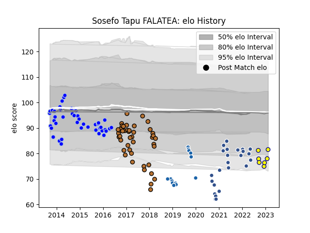

---  
layout: page  
title: Sosefo Tapu FALATEA  
date: 2023-01-31 16:08:05.482502  
categories: player  
---
# Sosefo Tapu FALATEA

## Positions: P

## Current elo: 70.0

## Current Percentile: 2.0

# Elo History

# Match History

| Team              |   Appearances |   Win Rate |
|:------------------|--------------:|-----------:|
| Colomiers         |            47 |   0.425532 |
| Narbonne          |            44 |   0.340909 |
| Agen              |            24 |   0.145833 |
| Castres Olympique |            15 |   0.333333 |
| Nevers            |             6 |   0.583333 |

| Opponent             |   Matches |   Win Rate |
|:---------------------|----------:|-----------:|
| Carcassonne          |         8 |   0.5      |
| Perpignan            |         7 |   0.357143 |
| Pau                  |         7 |   0.142857 |
| Albi                 |         7 |   0.285714 |
| Agen                 |         6 |   0.333333 |
| Aurillac             |         6 |   0.333333 |
| Bayonne              |         6 |   0.166667 |
| Beziers              |         6 |   0.333333 |
| Mont-de-Marsan       |         6 |   0.5      |
| La Rochelle          |         5 |   0        |
| Biarritz Olympique   |         5 |   0.3      |
| Bourgoin-Jallieu     |         5 |   0.8      |
| Narbonne             |         5 |   0.6      |
| Dax                  |         5 |   0.8      |
| Soyaux-Angouleme     |         4 |   0.5      |
| Montauban            |         4 |   0.5      |
| Vannes               |         4 |   0.5      |
| Bordeaux Begles      |         4 |   0        |
| Colomiers            |         4 |   0        |
| Nevers               |         3 |   0.333333 |
| Racing 92            |         3 |   0.333333 |
| Massy                |         3 |   0.666667 |
| Lyon                 |         3 |   0        |
| Clermont Auvergne    |         2 |   0.5      |
| Oyonnax              |         2 |   0        |
| Castres Olympique    |         2 |   0        |
| Gloucester Rugby     |         2 |   0.5      |
| Tarbes               |         2 |   0        |
| Toulon               |         2 |   0        |
| US Bressane          |         2 |   1        |
| Grenoble             |         2 |   0.25     |
| Montpellier Herault  |         1 |   0        |
| Auch                 |         1 |   0.5      |
| Stade Francais Paris |         1 |   0        |
| Stade Toulousain     |         1 |   0        |