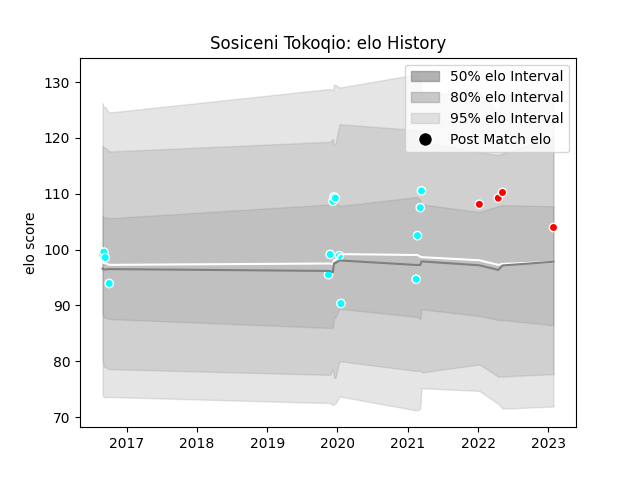

---  
layout: page  
title: Sosiceni Tokoqio  
date: 2023-01-30 17:52:11.993254  
categories: player  
---
# Sosiceni Tokoqio

## Positions: FL, N8

## Current elo: 104.0

## Current Percentile: None

# Elo History

# Match History

| Team                             |   Appearances |   Win Rate |
|:---------------------------------|--------------:|-----------:|
| Toyota Industries Shuttles Aichi |            15 |       0.6  |
| Kobelco Kobe Steelers            |             4 |       0.25 |

| Opponent                          |   Matches |   Win Rate |
|:----------------------------------|----------:|-----------:|
| Coca-Cola Red Sparks              |         2 |        0.5 |
| Kyuden Voltex                     |         2 |        1   |
| Toyota Verblitz                   |         2 |        0   |
| Urayasu D-Rocks                   |         2 |        0.5 |
| Chugoku Red Regulions             |         1 |        1   |
| Hanazono Kintetsu Liners          |         1 |        0   |
| Kamaishi Seawaves                 |         1 |        1   |
| Kobelco Kobe Steelers             |         1 |        0   |
| Kubota Spears Funabashi Tokyo-Bay |         1 |        0   |
| Kurita Water Gush                 |         1 |        1   |
| Mazda Blue Zoomers                |         1 |        1   |
| Munakata Sanix Blues              |         1 |        0   |
| Saitama Wild Knights              |         1 |        0   |
| Shimizu Blue Sharks               |         1 |        1   |
| Skyactivs Hiroshima               |         1 |        1   |