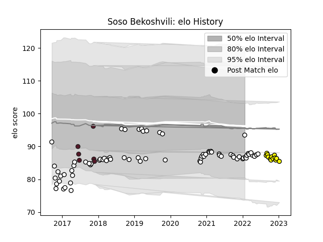

---  
layout: page  
title: Soso Bekoshvili  
date: 2022-12-18 16:17:37.119204  
categories: player  
---
# Soso Bekoshvili

## Positions: P

## Country: Georgia

## Current elo: 84.0

## Current Percentile: 7.0

# Elo History

# Match History

| Team        |   Appearances |   Win Rate |
|:------------|--------------:|-----------:|
| Brive       |            66 |   0.484848 |
| Carcassonne |            12 |   0.5      |
| Georgia     |             5 |   0.6      |

| Opponent                 |   Matches |   Win Rate |
|:-------------------------|----------:|-----------:|
| La Rochelle              |         5 |   0.4      |
| Pau                      |         5 |   0.4      |
| Bordeaux Begles          |         5 |   0.4      |
| Castres Olympique        |         5 |   0.6      |
| Worcester Warriors       |         4 |   0.75     |
| Stade Francais Paris     |         4 |   0.5      |
| Racing 92                |         4 |   0.25     |
| Clermont Auvergne        |         4 |   0.5      |
| Toulon                   |         3 |   0.666667 |
| Stade Toulousain         |         3 |   0        |
| Oyonnax                  |         3 |   1        |
| Montpellier Herault      |         3 |   0.333333 |
| Agen                     |         3 |   1        |
| Bayonne                  |         3 |   0.333333 |
| Dragons                  |         2 |   0.5      |
| Massy                    |         2 |   0.5      |
| Vannes                   |         2 |   0.5      |
| United States of America |         2 |   1        |
| Perpignan                |         2 |   0.5      |
| Rouen                    |         1 |   1        |
| Wales                    |         1 |   0        |
| US Bressane              |         1 |   0        |
| Aurillac                 |         1 |   1        |
| Bath Rugby               |         1 |   0        |
| Soyaux-Angouleme         |         1 |   0        |
| Saracens                 |         1 |   0        |
| RC Enisei                |         1 |   1        |
| Beziers                  |         1 |   1        |
| Grenoble                 |         1 |   0        |
| Provence Rugby           |         1 |   0        |
| Biarritz Olympique       |         1 |   1        |
| Canada                   |         1 |   1        |
| Newcastle Falcons        |         1 |   0        |
| Argentina                |         1 |   0        |
| Carcassonne              |         1 |   0        |
| Montauban                |         1 |   1        |
| Colomiers                |         1 |   0        |
| Nevers                   |         1 |   1        |