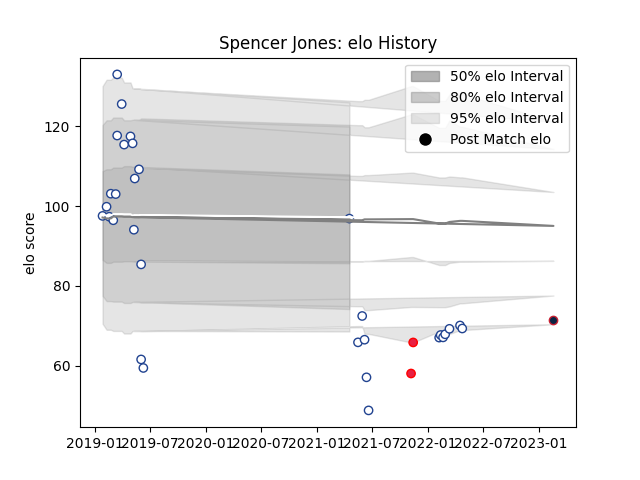

---  
layout: page  
title: Spencer Jones  
date: 2023-02-24 02:29:40.095737  
categories: player  
---
# Spencer Jones

## Positions: C

## Country: Canada

## Current elo: 97.0

## Current Percentile: None

# Elo History

# Match History

| Team                   |   Appearances |   Win Rate |
|:-----------------------|--------------:|-----------:|
| Toronto Arrows         |            31 |   0.516129 |
| Canada                 |             2 |   0.5      |
| New England Free Jacks |             1 |   1        |

| Opponent               |   Matches |   Win Rate |
|:-----------------------|----------:|-----------:|
| NOLA Gold              |         6 |   0.5      |
| Seattle Seawolves      |         5 |   0.4      |
| Houston SaberCats      |         3 |   0.666667 |
| San Diego Legion       |         3 |   0.666667 |
| Austin Elite Rugby     |         2 |   1        |
| Glendale Raptors       |         2 |   0.5      |
| New England Free Jacks |         2 |   0        |
| R.U. New York          |         2 |   0.5      |
| Rugby New York         |         2 |   0.5      |
| Utah Warriors          |         2 |   1        |
| Austin Gilgronis       |         1 |   0        |
| Belgium                |         1 |   1        |
| L. A. Giltinis         |         1 |   0        |
| Old Glory DC           |         1 |   1        |
| Portugal               |         1 |   0        |