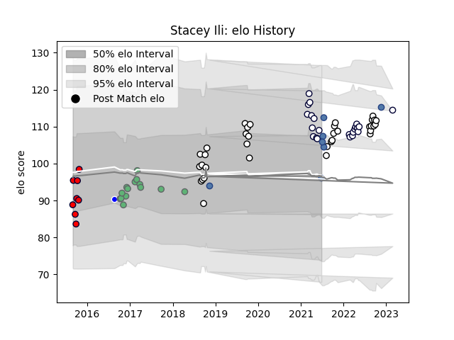

---  
layout: page  
title: Stacey Ili  
date: 2022-11-22 11:29:47.112548  
categories: player  
---
# Stacey Ili

## Positions: C, W

## Country: Samoa

## Current elo: 104.0

## Current Percentile: 69.0

# Elo History

# Match History

| Team             |   Appearances |   Win Rate |
|:-----------------|--------------:|-----------:|
| Hawke's Bay      |            35 |   0.571429 |
| Melbourne Rebels |            21 |   0.285714 |
| Connacht         |            15 |   0.533333 |
| Melbourne Rising |             8 |   0.5      |
| Samoa            |             5 |   0.8      |
| Auckland         |             1 |   0        |

| Opponent                 |   Matches |   Win Rate |
|:-------------------------|----------:|-----------:|
| Bay of Plenty            |         5 |   0.4      |
| Tasman                   |         5 |   0.4      |
| Otago                    |         5 |   0.6      |
| Western Force            |         4 |   0.5      |
| Queensland Reds          |         4 |   0        |
| Counties Manukau         |         3 |   0.666667 |
| Wellington               |         3 |   0.333333 |
| Waikato                  |         3 |   0.666667 |
| Tonga                    |         3 |   1        |
| New South Wales Waratahs |         3 |   0.666667 |
| Zebre                    |         3 |   0.666667 |
| Canterbury               |         3 |   0.333333 |
| Cardiff Blues            |         3 |   0.666667 |
| Benetton Treviso         |         2 |   1        |
| Blues                    |         2 |   0        |
| Brumbies                 |         2 |   0        |
| Canberra Vikings         |         2 |   0        |
| Taranaki                 |         2 |   0.5      |
| Southland                |         2 |   1        |
| North Harbour            |         2 |   0.5      |
| Chiefs                   |         2 |   0        |
| Glasgow Warriors         |         2 |   0        |
| Manawatu                 |         2 |   1        |
| New Zealand Maori        |         1 |   0        |
| Leinster                 |         1 |   0        |
| Fijian Drua              |         1 |   1        |
| Brisbane City            |         1 |   0        |
| Wasps                    |         1 |   0        |
| Ulster                   |         1 |   1        |
| Greater Sydney Rams      |         1 |   1        |
| Hurricanes               |         1 |   0        |
| Sydney Stars             |         1 |   1        |
| NSW Country Eagles       |         1 |   1        |
| Stade Toulousain         |         1 |   1        |
| Romania                  |         1 |   1        |
| Moana Pasifika           |         1 |   1        |
| Perth Spirit             |         1 |   0        |
| Dragons                  |         1 |   0        |
| Northland                |         1 |   1        |
| North Harbour Rays       |         1 |   1        |
| Crusaders                |         1 |   0        |