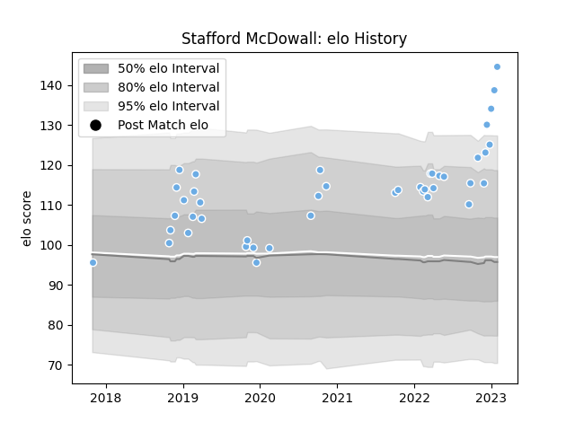

---  
layout: page  
title: Stafford McDowall  
date: 2022-12-14 11:34:37.328318  
categories: player  
---
# Stafford McDowall

## Positions: C

## Current elo: 111.0

## Current Percentile: 81.0

# Elo History

# Match History

| Team             |   Appearances |   Win Rate |
|:-----------------|--------------:|-----------:|
| Glasgow Warriors |            39 |   0.641026 |

| Opponent         |   Matches |   Win Rate |
|:-----------------|----------:|-----------:|
| Zebre            |         5 |   1        |
| Benetton Treviso |         4 |   0.5      |
| Cardiff Blues    |         4 |   0.75     |
| Scarlets         |         3 |   0.666667 |
| Connacht         |         3 |   0.666667 |
| Edinburgh        |         3 |   0.666667 |
| Southern Kings   |         2 |   1        |
| Ospreys          |         2 |   1        |
| Munster          |         2 |   0.5      |
| Leinster         |         2 |   0        |
| Lyon             |         1 |   1        |
| La Rochelle      |         1 |   0        |
| Dragons          |         1 |   0        |
| Saracens         |         1 |   0        |
| Cheetahs         |         1 |   1        |
| Sharks           |         1 |   1        |
| Bulls            |         1 |   0        |
| Ulster           |         1 |   0        |
| Bath Rugby       |         1 |   1        |