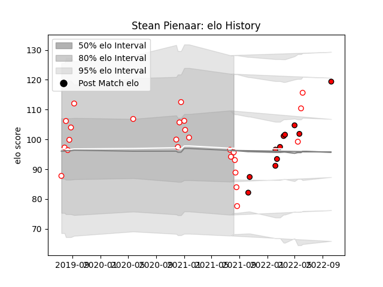

---  
layout: page  
title: Stean Pienaar  
date: 2023-03-17 17:17:01.910880  
categories: player  
---
# Stean Pienaar

## Positions: W

## Current elo: 96.0

## Current Percentile: 50.0

# Elo History

# Match History

| Team         |   Appearances |   Win Rate |
|:-------------|--------------:|-----------:|
| Golden Lions |            25 |   0.54     |
| Lions        |            11 |   0.454545 |

| Opponent            |   Matches |   Win Rate |
|:--------------------|----------:|-----------:|
| Blue Bulls          |         6 |      0     |
| Griquas             |         5 |      0.8   |
| Free State Cheetahs |         4 |      0.625 |
| Natal Sharks        |         4 |      0.5   |
| Western Province    |         4 |      0.75  |
| Bulls               |         2 |      0     |
| Pumas               |         2 |      1     |
| Benetton Treviso    |         1 |      1     |
| Cardiff Blues       |         1 |      1     |
| Dragons             |         1 |      1     |
| Edinburgh           |         1 |      1     |
| Glasgow Warriors    |         1 |      0     |
| Leinster            |         1 |      0     |
| Munster             |         1 |      1     |
| Stormers            |         1 |      0     |
| Ulster              |         1 |      0     |