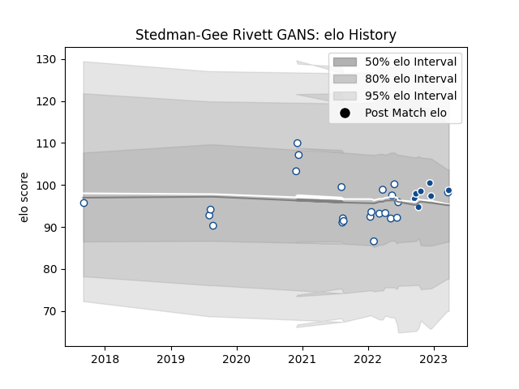

---  
layout: page  
title: Stedman-Gee Rivett GANS  
date: 2023-03-30 11:33:04.723755  
categories: player  
---
# Stedman-Gee Rivett GANS

Last updated: 2023-03-30
## Positions: C, W

## Current elo: 99.0

## Current Percentile: 54.0

# Elo History

# Match History

| Team       |   Appearances |   Win Rate |
|:-----------|--------------:|-----------:|
| Blue Bulls |            23 |   0.652174 |
| Bulls      |             7 |   0.571429 |

| Opponent            |   Matches |   Win Rate |
|:--------------------|----------:|-----------:|
| Griquas             |         6 |   0.666667 |
| Golden Lions        |         4 |   1        |
| Western Province    |         4 |   0.75     |
| Free State Cheetahs |         3 |   0.333333 |
| Natal Sharks        |         3 |   0        |
| Pumas               |         3 |   1        |
| Benetton Treviso    |         1 |   1        |
| Edinburgh           |         1 |   1        |
| Exeter Chiefs       |         1 |   0        |
| Glasgow Warriors    |         1 |   0        |
| Lions               |         1 |   1        |
| Lyon                |         1 |   1        |
| Ulster              |         1 |   0        |