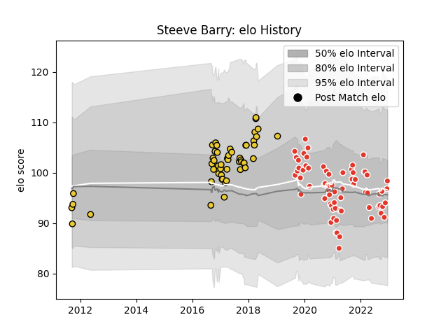

---  
layout: page  
title: Steeve Barry  
date: 2023-03-21 18:34:31.759504  
categories: player  
---
# Steeve Barry

Last updated: 2023-03-21
## Positions: W

## Current elo: 92.0

## Current Percentile: 57.0

# Elo History

# Match History

| Team               |   Appearances |   Win Rate |
|:-------------------|--------------:|-----------:|
| Biarritz Olympique |            80 |   0.55625  |
| La Rochelle        |            52 |   0.596154 |

| Opponent                   |   Matches |   Win Rate |
|:---------------------------|----------:|-----------:|
| Perpignan                  |         6 |   0.166667 |
| Grenoble                   |         6 |   1        |
| Vannes                     |         6 |   0.666667 |
| Carcassonne                |         6 |   0.666667 |
| Toulon                     |         6 |   0.416667 |
| Aurillac                   |         5 |   0.6      |
| Pau                        |         5 |   0.4      |
| Oyonnax                    |         5 |   0.8      |
| Montauban                  |         5 |   0.6      |
| Mont-de-Marsan             |         5 |   0.3      |
| Soyaux-Angouleme           |         5 |   0.8      |
| Lyon                       |         5 |   0.6      |
| Stade Francais Paris       |         5 |   0.4      |
| Montpellier Herault        |         4 |   0.25     |
| Clermont Auvergne          |         4 |   0.25     |
| Castres Olympique          |         4 |   0.5      |
| Bordeaux Begles            |         4 |   0.75     |
| Beziers                    |         4 |   0.5      |
| Bayonne                    |         4 |   0.875    |
| Stade Toulousain           |         4 |   0.75     |
| Colomiers                  |         3 |   0.666667 |
| Brive                      |         3 |   0.666667 |
| Rouen                      |         3 |   1        |
| Nevers                     |         3 |   0.333333 |
| Racing 92                  |         3 |   0.5      |
| Provence Rugby             |         2 |   0.75     |
| Agen                       |         2 |   0.5      |
| La Rochelle                |         2 |   0.5      |
| Zebre                      |         2 |   1        |
| Périgueux                  |         1 |   1        |
| Newcastle Falcons          |         1 |   0        |
| Albi                       |         1 |   0        |
| Roval Drome XV             |         1 |   1        |
| Scarlets                   |         1 |   0        |
| Massy                      |         1 |   1        |
| Gloucester Rugby           |         1 |   0        |
| Edinburgh                  |         1 |   1        |
| Valence Romans Drome Rugby |         1 |   0        |
| Benetton Treviso           |         1 |   1        |
| Wasps                      |         1 |   0        |