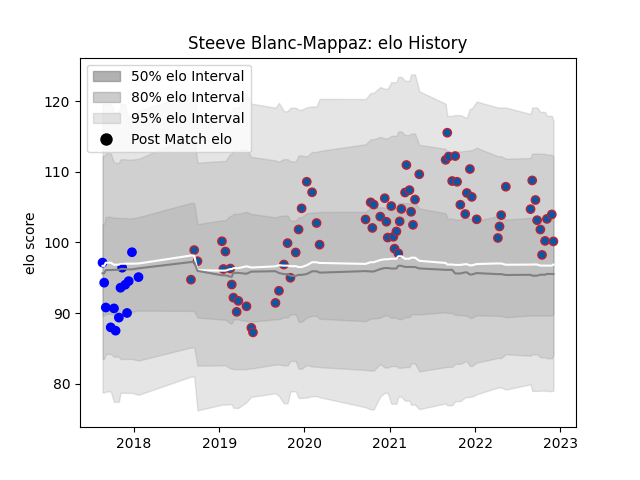

---  
layout: page  
title: Steeve Blanc-Mappaz  
date: 2022-12-18 16:34:21.800523  
categories: player  
---
# Steeve Blanc-Mappaz

## Positions: FL

## Current elo: 103.0

## Current Percentile: 66.0

# Elo History

# Match History

| Team     |   Appearances |   Win Rate |
|:---------|--------------:|-----------:|
| Grenoble |            75 |   0.486667 |
| Vannes   |            14 |   0.428571 |

| Opponent                   |   Matches |   Win Rate |
|:---------------------------|----------:|-----------:|
| Carcassonne                |         7 |   0.714286 |
| Oyonnax                    |         6 |   0.5      |
| Aurillac                   |         5 |   1        |
| Rouen                      |         5 |   0.8      |
| Nevers                     |         5 |   0.6      |
| Beziers                    |         5 |   0.6      |
| Perpignan                  |         5 |   0        |
| Colomiers                  |         5 |   0.2      |
| Vannes                     |         4 |   0.25     |
| Montauban                  |         4 |   0.375    |
| Provence Rugby             |         3 |   0.333333 |
| Biarritz Olympique         |         3 |   0.5      |
| Narbonne                   |         3 |   0.5      |
| Soyaux-Angouleme           |         3 |   0.666667 |
| Stade Toulousain           |         2 |   0        |
| US Bressane                |         2 |   0.5      |
| Valence Romans Drome Rugby |         2 |   1        |
| Agen                       |         2 |   1        |
| Massy                      |         2 |   0.5      |
| Lyon                       |         2 |   0        |
| Mont-de-Marsan             |         2 |   1        |
| Montpellier Herault        |         1 |   0        |
| La Rochelle                |         1 |   0        |
| Pau                        |         1 |   0        |
| Harlequins                 |         1 |   0        |
| Dax                        |         1 |   1        |
| Racing 92                  |         1 |   0        |
| Clermont Auvergne          |         1 |   0        |
| Roval Drome XV             |         1 |   1        |
| Castres Olympique          |         1 |   0        |
| Bordeaux Begles            |         1 |   0        |
| Benetton Treviso           |         1 |   0        |
| Bayonne                    |         1 |   0        |