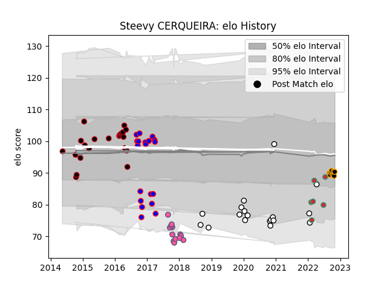

---  
layout: page  
title: Steevy CERQUEIRA  
date: 2023-02-28 11:06:30.549929  
categories: player  
---
# Steevy CERQUEIRA

## Positions: L, FL

## Country: Portugal

## Current elo: 90.0

## Current Percentile: 31.0

# Elo History

# Match History

| Team                 |   Appearances |   Win Rate |
|:---------------------|--------------:|-----------:|
| Lyon                 |            23 |   0.695652 |
| Beziers              |            19 |   0.368421 |
| Brive                |            18 |   0.305556 |
| Stade Francais Paris |            13 |   0.307692 |
| Chambery             |             8 |   0.5      |
| Portugal             |             6 |   0.25     |

| Opponent                   |   Matches |   Win Rate |
|:---------------------------|----------:|-----------:|
| Edinburgh                  |         5 |   0.4      |
| Dax                        |         4 |   0.5      |
| Narbonne                   |         4 |   0.5      |
| Montpellier Herault        |         4 |   0.25     |
| Biarritz Olympique         |         4 |   0.375    |
| Toulon                     |         4 |   0        |
| Oyonnax                    |         3 |   0.666667 |
| Mont-de-Marsan             |         3 |   0        |
| Carcassonne                |         3 |   0.666667 |
| Perpignan                  |         2 |   0.5      |
| Montauban                  |         2 |   0        |
| London Welsh               |         2 |   1        |
| Albi                       |         2 |   1        |
| La Rochelle                |         2 |   0.5      |
| Georgia                    |         2 |   0.25     |
| Agen                       |         2 |   1        |
| Colomiers                  |         2 |   0.5      |
| Stade Francais Paris       |         2 |   1        |
| Aurillac                   |         2 |   0.5      |
| Bayonne                    |         2 |   1        |
| Bordeaux Begles            |         2 |   0.5      |
| Tarbes                     |         2 |   0.5      |
| Clermont Auvergne          |         2 |   0        |
| Pau                        |         2 |   1        |
| Romania                    |         1 |   0        |
| Stade Toulousain           |         1 |   0        |
| Spain                      |         1 |   0        |
| Rennes                     |         1 |   1        |
| Saracens                   |         1 |   0        |
| US Bressane                |         1 |   0        |
| Vannes                     |         1 |   1        |
| Soyaux-Angouleme           |         1 |   0        |
| Provence Rugby             |         1 |   1        |
| Leicester Tigers           |         1 |   0        |
| Netherlands                |         1 |   1        |
| Lyon                       |         1 |   0        |
| Krasny Yar Krasnoyarsk     |         1 |   0        |
| Krasny Yar                 |         1 |   0        |
| Italy                      |         1 |   0        |
| Cognac Saint Jean d'Angély |         1 |   1        |
| Carqueiranne-Hyères        |         1 |   0        |
| Brive                      |         1 |   0        |
| Bristol Rugby              |         1 |   0        |
| Bourgoin-Jallieu           |         1 |   1        |
| Blagnac                    |         1 |   0        |
| Beziers                    |         1 |   1        |
| Zebre                      |         1 |   0        |