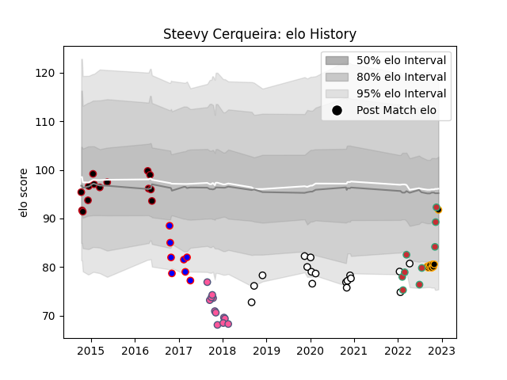

---  
layout: page  
title: Steevy Cerqueira  
date: 2022-12-09 13:21:00.353041  
categories: player  
---
# Steevy Cerqueira

## Positions: L, FL

## Country: Portugal

## Current elo: 92.0

## Current Percentile: 36.0

# Elo History

# Match History

| Team                 |   Appearances |   Win Rate |
|:---------------------|--------------:|-----------:|
| Brive                |            17 |   0.323529 |
| Lyon                 |            14 |   0.571429 |
| Stade Francais Paris |            12 |   0.333333 |
| Chambery             |             9 |   0.444444 |
| Portugal             |             9 |   0.444444 |
| Beziers              |             8 |   0.125    |

| Opponent                   |   Matches |   Win Rate |
|:---------------------------|----------:|-----------:|
| Edinburgh                  |         5 |       0.4  |
| Toulon                     |         4 |       0    |
| Montpellier Herault        |         4 |       0.25 |
| Biarritz Olympique         |         3 |       0.5  |
| Mont-de-Marsan             |         3 |       0    |
| Agen                       |         2 |       1    |
| Stade Francais Paris       |         2 |       1    |
| Pau                        |         2 |       1    |
| Oyonnax                    |         2 |       0.5  |
| Narbonne                   |         2 |       0.5  |
| Montauban                  |         2 |       0    |
| Albi                       |         2 |       0.5  |
| Georgia                    |         2 |       0.25 |
| London Welsh               |         2 |       1    |
| Clermont Auvergne          |         2 |       0    |
| Bordeaux Begles            |         2 |       0.5  |
| Dax                        |         1 |       0    |
| Beziers                    |         1 |       1    |
| Vannes                     |         1 |       1    |
| United States of America   |         1 |       0.5  |
| US Bressane                |         1 |       0    |
| Aurillac                   |         1 |       0    |
| Tarbes                     |         1 |       1    |
| Stade Toulousain           |         1 |       0    |
| Bayonne                    |         1 |       1    |
| Spain                      |         1 |       0    |
| Saracens                   |         1 |       0    |
| Romania                    |         1 |       0    |
| Rennes                     |         1 |       1    |
| Perpignan                  |         1 |       0    |
| Blagnac                    |         1 |       0    |
| Colomiers                  |         1 |       0    |
| Netherlands                |         1 |       1    |
| Bristol Rugby              |         1 |       0    |
| Brive                      |         1 |       0    |
| Carqueiranne-Hyères        |         1 |       0    |
| Lyon                       |         1 |       0    |
| La Rochelle                |         1 |       0    |
| Krasny Yar                 |         1 |       0    |
| Kenya                      |         1 |       1    |
| Italy                      |         1 |       0    |
| Hong Kong                  |         1 |       1    |
| Cognac Saint Jean d'Angély |         1 |       1    |
| Zebre                      |         1 |       0    |