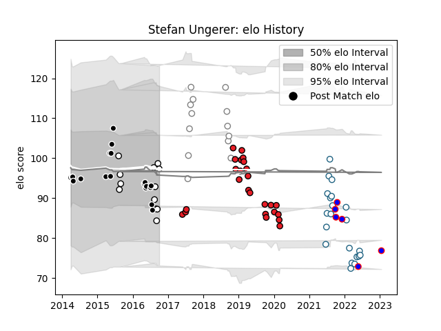

---  
layout: page  
title: Stefan Ungerer  
date: 2023-01-17 11:33:19.961906  
categories: player  
---
# Stefan Ungerer

## Positions: SH

## Current elo: 97.0

## Current Percentile: 22.0

# Elo History

# Match History

| Team           |   Appearances |   Win Rate |
|:---------------|--------------:|-----------:|
| Southern Kings |            25 |   0.14     |
| Griquas        |            21 |   0.547619 |
| Sharks         |            19 |   0.684211 |
| Pumas          |            13 |   0.461538 |
| Natal Sharks   |            12 |   0.583333 |
| Stormers       |             6 |   0.5      |

| Opponent                 |   Matches |   Win Rate |
|:-------------------------|----------:|-----------:|
| Golden Lions             |         9 |   0.444444 |
| Western Province         |         7 |   0.714286 |
| Free State Cheetahs      |         7 |   0.428571 |
| Cheetahs                 |         6 |   0.333333 |
| Blue Bulls               |         6 |   0.333333 |
| Pumas                    |         5 |   0.5      |
| Natal Sharks             |         5 |   0.2      |
| Lions                    |         4 |   0.25     |
| Munster                  |         4 |   0        |
| Connacht                 |         3 |   0        |
| Edinburgh                |         3 |   0.333333 |
| Griquas                  |         3 |   1        |
| Hurricanes               |         3 |   0.333333 |
| Eastern Province Kings   |         3 |   1        |
| Scarlets                 |         2 |   0.5      |
| New South Wales Waratahs |         2 |   0.5      |
| Stormers                 |         2 |   1        |
| Ulster                   |         2 |   0        |
| Benetton Treviso         |         2 |   0        |
| Jaguares                 |         2 |   1        |
| Dragons                  |         2 |   0.75     |
| Leinster                 |         2 |   0        |
| London Irish             |         1 |   1        |
| Melbourne Rebels         |         1 |   1        |
| Highlanders              |         1 |   0        |
| Ospreys                  |         1 |   0        |
| Chiefs                   |         1 |   0        |
| Queensland Reds          |         1 |   1        |
| Cardiff Blues            |         1 |   0        |
| Southern Kings           |         1 |   1        |
| Bulls                    |         1 |   1        |
| Sunwolves                |         1 |   1        |
| Boland Cavaliers         |         1 |   1        |
| Western Force            |         1 |   1        |