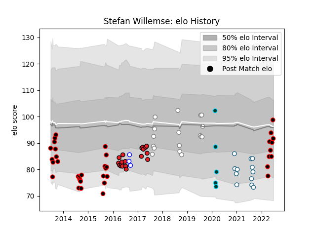

---  
layout: page  
title: Stefan Willemse  
date: 2023-03-12 11:34:14.259033  
categories: player  
---
# Stefan Willemse

## Positions: FL, L

## Current elo: 92.0

## Current Percentile: 56.0

# Elo History

# Match History

| Team                   |   Appearances |   Win Rate |
|:-----------------------|--------------:|-----------:|
| Eastern Province Kings |            37 |   0.432432 |
| Southern Kings         |            19 |   0.263158 |
| Pumas                  |            17 |   0.294118 |
| Griquas                |            12 |   0.208333 |
| Rugby ATL              |             5 |   0.2      |
| Western Province       |             3 |   1        |

| Opponent               |   Matches |   Win Rate |
|:-----------------------|----------:|-----------:|
| Natal Sharks           |        10 |   0.3      |
| Western Province       |         9 |   0.222222 |
| Golden Lions           |         9 |   0        |
| Blue Bulls             |         7 |   0.142857 |
| Pumas                  |         6 |   0.25     |
| Free State Cheetahs    |         5 |   0.2      |
| Griquas                |         4 |   0.75     |
| SWD Eagles             |         4 |   1        |
| Valke                  |         3 |   1        |
| Lions                  |         3 |   0        |
| Jaguares               |         3 |   0.333333 |
| Boland Cavaliers       |         3 |   0.666667 |
| Griffons               |         3 |   0.333333 |
| Sharks                 |         3 |   0.333333 |
| Sunwolves              |         2 |   1        |
| Leopards               |         2 |   1        |
| Old Glory DC           |         1 |   0        |
| Rugby New York         |         1 |   0        |
| Stormers               |         1 |   0        |
| R.U. New York          |         1 |   0        |
| Toronto Arrows         |         1 |   0        |
| Black Lion             |         1 |   0        |
| NOLA Gold              |         1 |   1        |
| Melbourne Rebels       |         1 |   1        |
| Hurricanes             |         1 |   0        |
| Highlanders            |         1 |   0        |
| Eastern Province Kings |         1 |   1        |
| Cheetahs               |         1 |   0        |
| Bulls                  |         1 |   0        |
| Brumbies               |         1 |   0        |
| Border Bulldogs        |         1 |   1        |
| Blues                  |         1 |   0        |
| Zimbabwe Goshawks      |         1 |   1        |