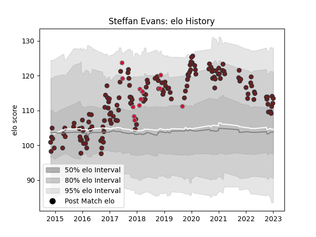

---  
layout: page  
title: Steffan Evans  
date: 2022-12-18 16:39:45.754994  
categories: player  
---
# Steffan Evans

## Positions: W

## Country: Wales

## Current elo: 103.0

## Current Percentile: 61.0

# Elo History

# Match History

| Team     |   Appearances |   Win Rate |
|:---------|--------------:|-----------:|
| Scarlets |           147 |   0.554422 |
| Wales    |            13 |   0.615385 |

| Opponent           |   Matches |   Win Rate |
|:-------------------|----------:|-----------:|
| Cardiff Blues      |        14 |   0.428571 |
| Benetton Treviso   |        13 |   0.846154 |
| Ospreys            |        11 |   0.636364 |
| Glasgow Warriors   |        11 |   0.545455 |
| Dragons            |        10 |   0.8      |
| Edinburgh          |        10 |   0.4      |
| Ulster             |        10 |   0.3      |
| Connacht           |         9 |   0.777778 |
| Munster            |         9 |   0.222222 |
| Zebre              |         9 |   1        |
| Toulon             |         6 |   0.166667 |
| Leinster           |         5 |   0.4      |
| Racing 92          |         4 |   0        |
| Cheetahs           |         3 |   1        |
| Southern Kings     |         3 |   1        |
| Bayonne            |         3 |   1        |
| Tonga              |         2 |   1        |
| Scotland           |         2 |   1        |
| Saracens           |         2 |   0.25     |
| Sale Sharks        |         2 |   0.5      |
| Lions              |         2 |   0.5      |
| London Irish       |         2 |   1        |
| Leicester Tigers   |         2 |   0.5      |
| Ireland            |         2 |   0        |
| Bath Rugby         |         1 |   0        |
| Northampton Saints |         1 |   0        |
| La Rochelle        |         1 |   1        |
| Samoa              |         1 |   1        |
| Italy              |         1 |   1        |
| New Zealand        |         1 |   0        |
| Sharks             |         1 |   0        |
| South Africa       |         1 |   1        |
| France             |         1 |   1        |
| Stormers           |         1 |   0        |
| England            |         1 |   0        |
| Bulls              |         1 |   0        |
| Bordeaux Begles    |         1 |   0        |
| Australia          |         1 |   0        |