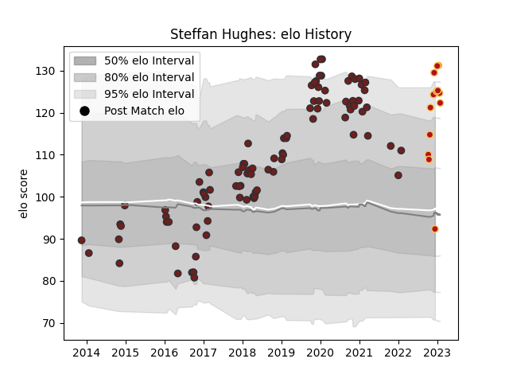

---  
layout: page  
title: Steffan Hughes  
date: 2022-12-09 13:14:19.892821  
categories: player  
---
# Steffan Hughes

## Positions: C

## Current elo: 126.0

## Current Percentile: 95.0

# Elo History

# Match History

| Team     |   Appearances |   Win Rate |
|:---------|--------------:|-----------:|
| Scarlets |            93 |   0.575269 |
| Dragons  |             6 |   0.333333 |

| Opponent           |   Matches |   Win Rate |
|:-------------------|----------:|-----------:|
| Benetton Treviso   |        11 |   0.727273 |
| Cardiff Blues      |         7 |   0.571429 |
| Dragons            |         7 |   0.857143 |
| Glasgow Warriors   |         7 |   0.714286 |
| Leinster           |         7 |   0.214286 |
| Edinburgh          |         6 |   0.333333 |
| Ulster             |         6 |   0.333333 |
| Munster            |         6 |   0.166667 |
| Zebre              |         5 |   1        |
| Ospreys            |         5 |   0.8      |
| Cheetahs           |         4 |   0.75     |
| Connacht           |         4 |   1        |
| Toulon             |         4 |   0.25     |
| Saracens           |         3 |   0        |
| Racing 92          |         2 |   0        |
| Leicester Tigers   |         2 |   0.5      |
| Northampton Saints |         2 |   0        |
| London Irish       |         2 |   1        |
| Bayonne            |         2 |   1        |
| Southern Kings     |         2 |   1        |
| Stormers           |         1 |   0        |
| Bath Rugby         |         1 |   1        |
| Sale Sharks        |         1 |   0        |
| Gloucester Rugby   |         1 |   1        |
| Lions              |         1 |   0        |