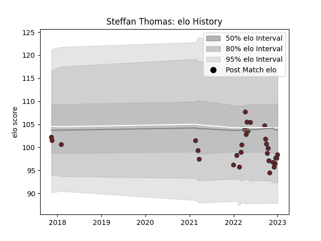

---  
layout: page  
title: Steffan Thomas  
date: 2022-12-18 16:40:07.398243  
categories: player  
---
# Steffan Thomas

## Positions: P

## Current elo: 90.0

## Current Percentile: 21.0

# Elo History

# Match History

| Team     |   Appearances |   Win Rate |
|:---------|--------------:|-----------:|
| Scarlets |            28 |      0.375 |

| Opponent         |   Matches |   Win Rate |
|:-----------------|----------:|-----------:|
| Ospreys          |         3 |   0.5      |
| Cardiff Blues    |         3 |   0.666667 |
| Connacht         |         3 |   0.333333 |
| Dragons          |         3 |   0.333333 |
| Ulster           |         2 |   0        |
| Stormers         |         2 |   0        |
| Benetton Treviso |         2 |   0.5      |
| Bayonne          |         1 |   1        |
| Sharks           |         1 |   0        |
| Sale Sharks      |         1 |   0        |
| Leinster         |         1 |   0        |
| Munster          |         1 |   0        |
| Lions            |         1 |   0        |
| Glasgow Warriors |         1 |   1        |
| Exeter Chiefs    |         1 |   0        |
| Cheetahs         |         1 |   1        |
| Zebre            |         1 |   1        |