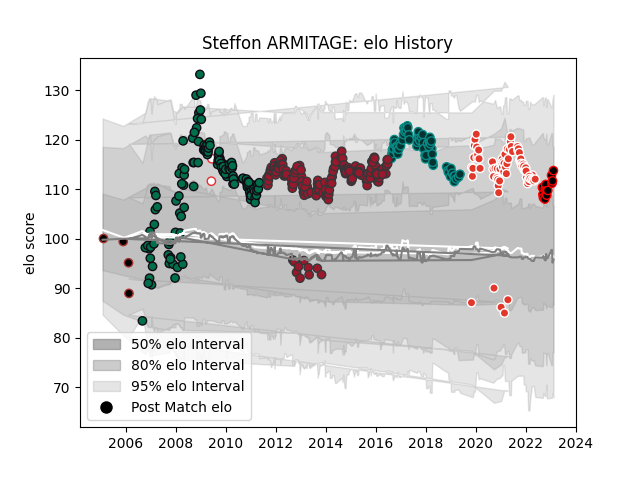

---  
layout: page  
title: Steffon ARMITAGE  
date: 2023-01-27 11:06:44.794014  
categories: player  
---
# Steffon ARMITAGE

## Positions: FL, N8

## Country: England

## Current elo: 102.0

## Current Percentile: 64.0

# Elo History

# Match History

| Team               |   Appearances |   Win Rate |
|:-------------------|--------------:|-----------:|
| Toulon             |           159 |   0.701258 |
| London Irish       |           120 |   0.545833 |
| Biarritz Olympique |            65 |   0.469231 |
| Pau                |            62 |   0.524194 |
| Nice               |            11 |   0.227273 |
| England            |             5 |   0.8      |
| Saracens           |             4 |   0.25     |

| Opponent                   |   Matches |   Win Rate |
|:---------------------------|----------:|-----------:|
| Montpellier Herault        |        18 |   0.527778 |
| Racing 92                  |        18 |   0.555556 |
| Castres Olympique          |        18 |   0.444444 |
| Clermont Auvergne          |        17 |   0.5      |
| Bordeaux Begles            |        16 |   0.625    |
| Stade Toulousain           |        16 |   0.3125   |
| Stade Francais Paris       |        16 |   0.65625  |
| Brive                      |        15 |   0.733333 |
| Leicester Tigers           |        14 |   0.357143 |
| Grenoble                   |        14 |   0.714286 |
| Wasps                      |        13 |   0.461538 |
| Harlequins                 |        13 |   0.653846 |
| Sale Sharks                |        13 |   0.769231 |
| Perpignan                  |        12 |   0.541667 |
| Saracens                   |        11 |   0.545455 |
| Newcastle Falcons          |        11 |   0.772727 |
| Bath Rugby                 |        11 |   0.409091 |
| Oyonnax                    |        10 |   0.8      |
| Lyon                       |        10 |   0.5      |
| Northampton Saints         |         9 |   0.333333 |
| Gloucester Rugby           |         9 |   0.444444 |
| Toulon                     |         8 |   0        |
| Worcester Warriors         |         8 |   0.8125   |
| Bayonne                    |         8 |   0.875    |
| La Rochelle                |         8 |   0.5      |
| Agen                       |         7 |   0.714286 |
| Biarritz Olympique         |         7 |   0.714286 |
| Cardiff Blues              |         6 |   0.666667 |
| Leinster                   |         6 |   0.916667 |
| Leeds                      |         5 |   0.6      |
| Bristol Rugby              |         5 |   0.8      |
| Pau                        |         4 |   0.5      |
| Scarlets                   |         4 |   0.5      |
| Yorkshire Carnegie         |         4 |   0.5      |
| Montauban                  |         4 |   0.5      |
| Carcassonne                |         4 |   0.5      |
| Mont-de-Marsan             |         3 |   0.666667 |
| Provence Rugby             |         3 |   0.833333 |
| Vannes                     |         3 |   0.666667 |
| Bourgoin-Jallieu           |         3 |   0        |
| Soyaux-Angouleme           |         3 |   1        |
| Colomiers                  |         3 |   0.666667 |
| Dax                        |         3 |   0.333333 |
| Exeter Chiefs              |         3 |   1        |
| Nevers                     |         3 |   0.333333 |
| Valence Romans Drome Rugby |         3 |   0.333333 |
| Ulster                     |         2 |   1        |
| Rouen                      |         2 |   1        |
| Glasgow Warriors           |         2 |   1        |
| Aurillac                   |         2 |   1        |
| Italy                      |         2 |   1        |
| Ospreys                    |         2 |   1        |
| Argentina                  |         2 |   0.5      |
| Beziers                    |         2 |   0.5      |
| Wales                      |         1 |   1        |
| Munster                    |         1 |   1        |
| US Bressane                |         1 |   0        |
| Tarbes                     |         1 |   1        |
| Narbonne                   |         1 |   0        |
| Cognac Saint Jean d'Angély |         1 |   1        |
| Albi                       |         1 |   0.5      |
| Chambery                   |         1 |   0        |