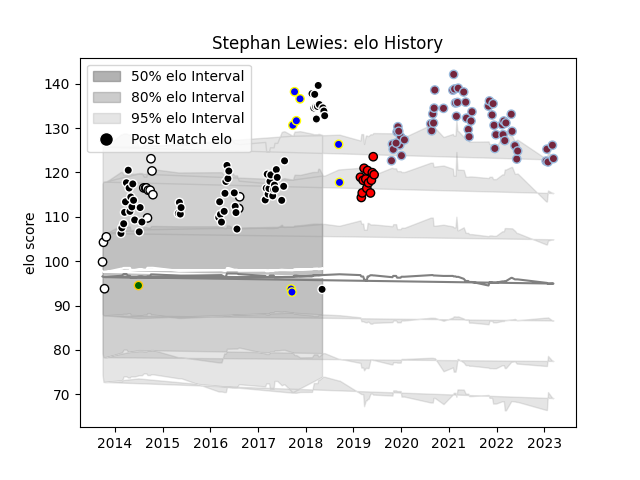

---  
layout: page  
title: Stephan Lewies  
date: 2023-03-17 17:20:13.506690  
categories: player  
---
# Stephan Lewies

## Positions: L, FL

## Country: South Africa

## Current elo: 94.0

## Current Percentile: 97.0

# Elo History

# Match History

| Team              |   Appearances |   Win Rate |
|:------------------|--------------:|-----------:|
| Sharks            |            63 |   0.547619 |
| Harlequins        |            54 |   0.583333 |
| Natal Sharks      |            15 |   0.7      |
| Lions             |            14 |   0.5      |
| Kamaishi Seawaves |             8 |   0.1875   |
| South Africa      |             1 |   1        |

| Opponent                 |   Matches |   Win Rate |
|:-------------------------|----------:|-----------:|
| Lions                    |         7 |   0.285714 |
| Bulls                    |         7 |   0.214286 |
| Stormers                 |         6 |   0.666667 |
| Exeter Chiefs            |         6 |   0.333333 |
| Jaguares                 |         6 |   0.833333 |
| Hurricanes               |         6 |   0.333333 |
| Highlanders              |         5 |   0.6      |
| Wasps                    |         5 |   1        |
| Saracens                 |         5 |   0.2      |
| Northampton Saints       |         5 |   0.6      |
| New South Wales Waratahs |         5 |   0.7      |
| Leicester Tigers         |         5 |   0.5      |
| Sunwolves                |         4 |   1        |
| Sale Sharks              |         4 |   0.5      |
| Melbourne Rebels         |         4 |   0.625    |
| London Irish             |         4 |   0.5      |
| Bath Rugby               |         4 |   0.75     |
| Cheetahs                 |         4 |   0.75     |
| Bristol Rugby            |         4 |   0.75     |
| Brumbies                 |         4 |   0.25     |
| Crusaders                |         4 |   0.25     |
| Chiefs                   |         3 |   0.666667 |
| Western Province         |         3 |   0.666667 |
| Blues                    |         3 |   0.666667 |
| Southern Kings           |         3 |   0.666667 |
| Sharks                   |         3 |   0.333333 |
| Queensland Reds          |         3 |   0.666667 |
| Golden Lions             |         3 |   0.666667 |
| Griquas                  |         3 |   0.666667 |
| Gloucester Rugby         |         3 |   1        |
| Mitsubishi Dynaboars     |         2 |   0        |
| Newcastle Falcons        |         2 |   0.5      |
| Pumas                    |         2 |   0.5      |
| Mazda Blue Zoomers       |         2 |   0.25     |
| Ulster                   |         2 |   0        |
| Free State Cheetahs      |         2 |   0.75     |
| Eastern Province Kings   |         1 |   1        |
| Hino Red Dolphins        |         1 |   0        |
| Western Force            |         1 |   1        |
| Kyuden Voltex            |         1 |   0        |
| Scotland                 |         1 |   1        |
| Blue Bulls               |         1 |   1        |
| Mie Honda Heat           |         1 |   0        |
| Cardiff Blues            |         1 |   1        |
| Castres Olympique        |         1 |   1        |
| Racing 92                |         1 |   0        |
| Chugoku Red Regulions    |         1 |   1        |
| Worcester Warriors       |         1 |   1        |