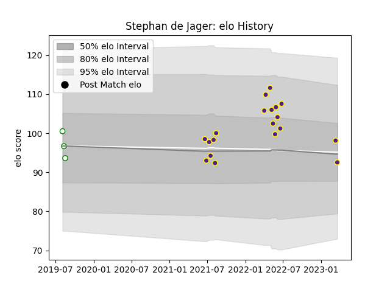

---  
layout: page  
title: Stephan de Jager  
date: 2023-03-21 18:54:25.069371  
categories: player  
---
# Stephan de Jager

Last updated: 2023-03-21
## Positions: P

## Current elo: 93.0

## Current Percentile: 60.0

# Elo History

# Match History

| Team     |   Appearances |   Win Rate |
|:---------|--------------:|-----------:|
| Griffons |            19 |   0.789474 |
| Leopards |             3 |   0.333333 |

| Opponent               |   Matches |   Win Rate |
|:-----------------------|----------:|-----------:|
| Boland Cavaliers       |         3 |   1        |
| Eastern Province Kings |         3 |   1        |
| Leopards               |         3 |   0.333333 |
| Valke                  |         3 |   1        |
| Border Bulldogs        |         2 |   1        |
| Black Lion             |         1 |   1        |
| Free State Cheetahs    |         1 |   0        |
| Griffons               |         1 |   0        |
| Jaguares XV            |         1 |   0        |
| Natal Sharks           |         1 |   0        |
| SWD Eagles             |         1 |   1        |
| Tusker Simba           |         1 |   1        |
| Zimbabwe Goshawks      |         1 |   1        |