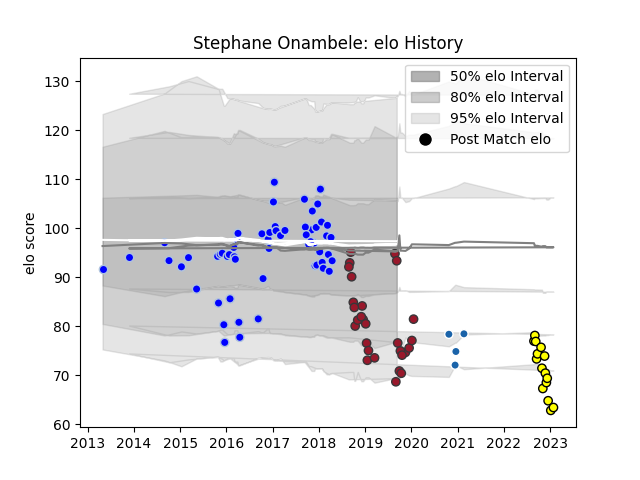

---  
layout: page  
title: Stephane Onambele  
date: 2023-01-13 11:28:39.936383  
categories: player  
---
# Stephane Onambele

## Positions: FL

## Current elo: 93.0

## Current Percentile: 4.0

# Elo History

# Match History

| Team              |   Appearances |   Win Rate |
|:------------------|--------------:|-----------:|
| Colomiers         |            59 |   0.457627 |
| Toulon            |            28 |   0.5      |
| Carcassonne       |            14 |   0.428571 |
| Castres Olympique |             4 |   0        |

| Opponent             |   Matches |   Win Rate |
|:---------------------|----------:|-----------:|
| Bayonne              |         6 |   0.583333 |
| Mont-de-Marsan       |         6 |   0.583333 |
| Agen                 |         5 |   0.6      |
| Dax                  |         5 |   0.6      |
| Narbonne             |         5 |   0.7      |
| Racing 92            |         4 |   0.25     |
| Grenoble             |         4 |   0.5      |
| Montpellier Herault  |         4 |   0.25     |
| Perpignan            |         4 |   0.625    |
| Montauban            |         4 |   0.5      |
| Biarritz Olympique   |         4 |   0.5      |
| Beziers              |         4 |   0.25     |
| Aurillac             |         4 |   0.75     |
| Stade Francais Paris |         3 |   0.333333 |
| Newcastle Falcons    |         3 |   0.333333 |
| Tarbes               |         3 |   0.333333 |
| Soyaux-Angouleme     |         3 |   0.333333 |
| Massy                |         3 |   0.666667 |
| Vannes               |         3 |   0        |
| Carcassonne          |         3 |   0.333333 |
| Oyonnax              |         2 |   0.5      |
| Bourgoin-Jallieu     |         2 |   0.5      |
| Provence Rugby       |         2 |   0.5      |
| Castres Olympique    |         2 |   1        |
| Lyon                 |         2 |   0        |
| Nevers               |         2 |   0.5      |
| Colomiers            |         2 |   0        |
| Clermont Auvergne    |         1 |   0        |
| Ospreys              |         1 |   0        |
| Albi                 |         1 |   0        |
| Edinburgh            |         1 |   0        |
| La Rochelle          |         1 |   1        |
| Rouen                |         1 |   1        |
| Brive                |         1 |   0        |
| London Irish         |         1 |   1        |
| Bordeaux Begles      |         1 |   0        |
| Toulon               |         1 |   0        |
| Pau                  |         1 |   0        |