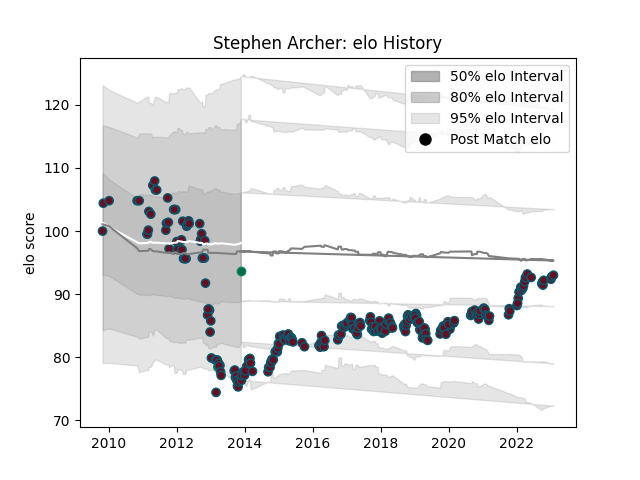

---  
layout: page  
title: Stephen Archer  
date: 2023-02-02 18:39:03.085631  
categories: player  
---
# Stephen Archer

## Positions: P

## Country: Ireland

## Current elo: 94.0

## Current Percentile: 4.0

# Elo History

# Match History

| Team    |   Appearances |   Win Rate |
|:--------|--------------:|-----------:|
| Munster |           257 |   0.692607 |
| Ireland |             3 |   0.166667 |

| Opponent           |   Matches |   Win Rate |
|:-------------------|----------:|-----------:|
| Ulster             |        22 |   0.590909 |
| Connacht           |        21 |   0.761905 |
| Ospreys            |        21 |   0.690476 |
| Leinster           |        20 |   0.3      |
| Edinburgh          |        20 |   0.7      |
| Benetton Treviso   |        18 |   0.833333 |
| Scarlets           |        18 |   0.611111 |
| Glasgow Warriors   |        18 |   0.666667 |
| Cardiff Blues      |        17 |   0.764706 |
| Dragons            |        17 |   0.882353 |
| Zebre              |        12 |   1        |
| Saracens           |         8 |   0.375    |
| Racing 92          |         7 |   0.357143 |
| Castres Olympique  |         5 |   0.7      |
| Leicester Tigers   |         4 |   0.75     |
| Gloucester Rugby   |         4 |   1        |
| Cheetahs           |         4 |   1        |
| Sale Sharks        |         2 |   1        |
| Exeter Chiefs      |         2 |   0.75     |
| Bulls              |         2 |   0.5      |
| Southern Kings     |         2 |   1        |
| Clermont Auvergne  |         2 |   0        |
| Aironi             |         2 |   0.5      |
| Perpignan          |         2 |   1        |
| Italy              |         1 |   0        |
| France             |         1 |   0.5      |
| Northampton Saints |         1 |   1        |
| Lions              |         1 |   1        |
| Stade Toulousain   |         1 |   1        |
| Stormers           |         1 |   1        |
| Toulon             |         1 |   1        |
| Australia          |         1 |   0        |
| Wasps              |         1 |   1        |
| Harlequins         |         1 |   1        |