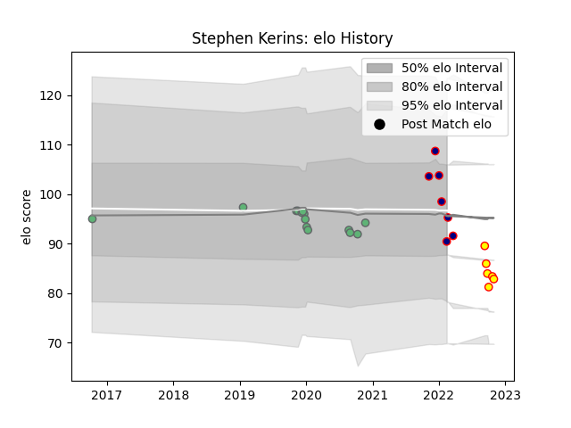

---  
layout: page  
title: Stephen Kerins  
date: 2023-03-28 16:55:21.824165  
categories: player  
---
# Stephen Kerins

Last updated: 2023-03-28
## Positions: SH

## Current elo: 90.0

## Current Percentile: 55.0

# Elo History

# Match History

| Team            |   Appearances |   Win Rate |
|:----------------|--------------:|-----------:|
| Connacht        |            14 |   0.428571 |
| London Scottish |             7 |   0        |
| Richmond        |             6 |   0.333333 |

| Opponent            |   Matches |   Win Rate |
|:--------------------|----------:|-----------:|
| Ulster              |         3 |   0.666667 |
| Cornish Pirates     |         3 |   0        |
| Bedford             |         3 |   0.333333 |
| Munster             |         2 |   0        |
| Nottingham          |         2 |   0        |
| Gloucester Rugby    |         2 |   0.5      |
| Leinster            |         2 |   0        |
| Ampthill            |         1 |   0        |
| Stade Toulousain    |         1 |   0        |
| Richmond            |         1 |   0        |
| Hartpury College    |         1 |   1        |
| Montpellier Herault |         1 |   1        |
| Doncaster           |         1 |   0        |
| Cardiff Blues       |         1 |   0        |
| Caldy               |         1 |   0        |
| Bordeaux Begles     |         1 |   1        |
| Zebre               |         1 |   1        |