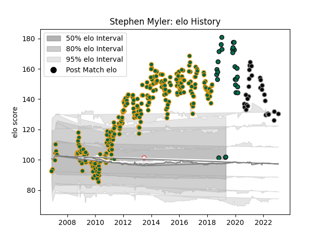

---  
layout: page  
title: Stephen Myler  
date: 2023-02-02 19:05:36.251212  
categories: player  
---
# Stephen Myler

## Positions: FH

## Country: England

## Current elo: 102.0

## Current Percentile: 100.0

# Elo History

# Match History

| Team               |   Appearances |   Win Rate |
|:-------------------|--------------:|-----------:|
| Northampton Saints |           308 |   0.613636 |
| Ospreys            |            30 |   0.6      |
| London Irish       |            28 |   0.589286 |
| England            |             1 |   1        |

| Opponent            |   Matches |   Win Rate |
|:--------------------|----------:|-----------:|
| Saracens            |        35 |   0.4      |
| Harlequins          |        24 |   0.583333 |
| Sale Sharks         |        24 |   0.645833 |
| Leicester Tigers    |        23 |   0.413043 |
| Wasps               |        22 |   0.590909 |
| Gloucester Rugby    |        22 |   0.613636 |
| Bath Rugby          |        21 |   0.619048 |
| Worcester Warriors  |        18 |   0.777778 |
| London Irish        |        17 |   0.764706 |
| Newcastle Falcons   |        17 |   0.588235 |
| Exeter Chiefs       |        16 |   0.5      |
| Castres Olympique   |        11 |   0.636364 |
| Scarlets            |        11 |   0.636364 |
| Ulster              |         7 |   0.428571 |
| Munster             |         7 |   0.285714 |
| Ospreys             |         7 |   0.857143 |
| Benetton Treviso    |         6 |   1        |
| Dragons             |         6 |   0.75     |
| Cardiff Blues       |         6 |   0.666667 |
| Bristol Rugby       |         6 |   0.583333 |
| Leinster            |         6 |   0.166667 |
| Glasgow Warriors    |         5 |   0.8      |
| Racing 92           |         4 |   0.125    |
| London Welsh        |         4 |   1        |
| Edinburgh           |         4 |   1        |
| Leeds               |         3 |   1        |
| Yorkshire Carnegie  |         3 |   1        |
| Perpignan           |         3 |   0.666667 |
| Montpellier Herault |         3 |   1        |
| Nottingham          |         2 |   1        |
| Richmond            |         2 |   1        |
| Toulon              |         2 |   0.5      |
| Zebre               |         2 |   1        |
| Ealing Trailfinders |         2 |   1        |
| Connacht            |         2 |   0.5      |
| Northampton Saints  |         1 |   1        |
| London Scottish     |         1 |   1        |
| Jersey              |         1 |   0        |
| Hartpury College    |         1 |   1        |
| Crociati Rugby      |         1 |   1        |
| Coventry            |         1 |   1        |
| Cornish Pirates     |         1 |   1        |
| Sharks              |         1 |   0        |
| Stormers            |         1 |   0.5      |
| Clermont Auvergne   |         1 |   0        |
| Bulls               |         1 |   0        |
| Bourgoin-Jallieu    |         1 |   1        |
| Bedford             |         1 |   1        |
| Argentina           |         1 |   1        |