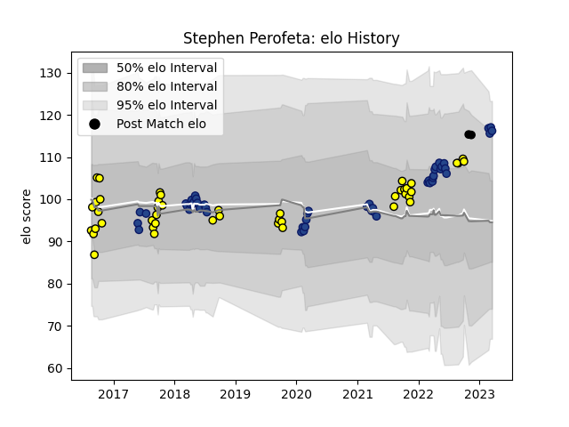

---  
layout: page  
title: Stephen Perofeta  
date: 2022-11-22 11:32:24.514960  
categories: player  
---
# Stephen Perofeta

## Positions: FB, FH

## Country: New Zealand

## Current elo: 112.0

## Current Percentile: 87.0

# Elo History

# Match History

| Team        |   Appearances |   Win Rate |
|:------------|--------------:|-----------:|
| Blues       |            46 |   0.576087 |
| Taranaki    |            41 |   0.646341 |
| New Zealand |             3 |   0.666667 |

| Opponent                 |   Matches |   Win Rate |
|:-------------------------|----------:|-----------:|
| Crusaders                |         7 |   0.142857 |
| Hurricanes               |         6 |   0.5      |
| Chiefs                   |         6 |   0.416667 |
| Highlanders              |         6 |   0.666667 |
| Bay of Plenty            |         5 |   0.6      |
| Auckland                 |         5 |   0.4      |
| Tasman                   |         4 |   0.25     |
| Southland                |         4 |   1        |
| Hawke's Bay              |         4 |   0.75     |
| Manawatu                 |         3 |   1        |
| Waikato                  |         3 |   0.5      |
| Queensland Reds          |         3 |   1        |
| Wellington               |         3 |   0.666667 |
| Canterbury               |         3 |   0.666667 |
| Otago                    |         2 |   1        |
| Lions                    |         2 |   1        |
| Counties Manukau         |         2 |   1        |
| Melbourne Rebels         |         2 |   0.5      |
| Moana Pasifika           |         2 |   1        |
| New South Wales Waratahs |         2 |   1        |
| North Harbour            |         2 |   0        |
| Brumbies                 |         2 |   1        |
| Sunwolves                |         2 |   0.5      |
| Stormers                 |         2 |   0.5      |
| Bulls                    |         1 |   1        |
| British and Irish Lions  |         1 |   1        |
| Jaguares                 |         1 |   0        |
| Sharks                   |         1 |   0        |
| Scotland                 |         1 |   1        |
| Japan                    |         1 |   1        |
| Northland                |         1 |   1        |
| Argentina                |         1 |   0        |