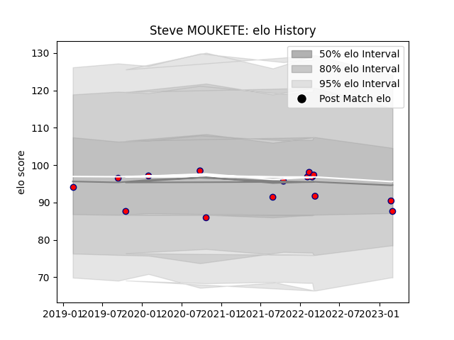

---  
layout: page  
title: Steve MOUKETE  
date: 2023-03-02 11:23:15.174977  
categories: player  
---
# Steve MOUKETE

## Positions: FL, L

## Current elo: 90.0

## Current Percentile: 40.0

# Elo History

# Match History

| Team     |   Appearances |   Win Rate |
|:---------|--------------:|-----------:|
| Aurillac |            14 |   0.285714 |

| Opponent         |   Matches |   Win Rate |
|:-----------------|----------:|-----------:|
| Mont-de-Marsan   |         2 |          0 |
| Agen             |         1 |          1 |
| Beziers          |         1 |          0 |
| Carcassonne      |         1 |          1 |
| Colomiers        |         1 |          1 |
| Grenoble         |         1 |          0 |
| Montauban        |         1 |          1 |
| Oyonnax          |         1 |          0 |
| Provence Rugby   |         1 |          0 |
| Rouen            |         1 |          0 |
| Soyaux-Angouleme |         1 |          0 |
| US Bressane      |         1 |          0 |
| Vannes           |         1 |          0 |