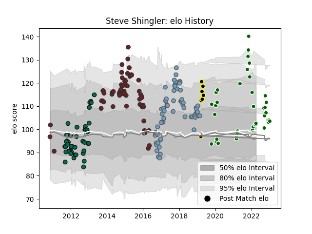

---  
layout: page  
title: Steve Shingler  
date: 2023-01-13 11:23:34.331539  
categories: player  
---
# Steve Shingler

## Positions: FH, C

## Current elo: 103.0

## Current Percentile: 77.0

# Elo History

# Match History

| Team                |   Appearances |   Win Rate |
|:--------------------|--------------:|-----------:|
| Cardiff Blues       |            65 |   0.515385 |
| Scarlets            |            63 |   0.531746 |
| London Irish        |            47 |   0.393617 |
| Ealing Trailfinders |            39 |   0.871795 |
| Mont-de-Marsan      |             7 |   0.571429 |

| Opponent           |   Matches |   Win Rate |
|:-------------------|----------:|-----------:|
| Zebre              |        11 |   0.954545 |
| Glasgow Warriors   |        11 |   0.181818 |
| Ospreys            |         9 |   0.222222 |
| Edinburgh          |         9 |   0.5      |
| Dragons            |         9 |   1        |
| Ulster             |         9 |   0.444444 |
| Munster            |         8 |   0.4375   |
| Cardiff Blues      |         8 |   0.25     |
| Leinster           |         8 |   0.25     |
| Connacht           |         7 |   0.571429 |
| Benetton Treviso   |         7 |   1        |
| Saracens           |         6 |   0.166667 |
| Leicester Tigers   |         6 |   0.25     |
| Bath Rugby         |         6 |   0.333333 |
| Gloucester Rugby   |         6 |   0.333333 |
| Northampton Saints |         5 |   0.4      |
| Coventry           |         5 |   1        |
| Scarlets           |         5 |   0.2      |
| Bedford            |         5 |   0.8      |
| Harlequins         |         5 |   0.2      |
| Nottingham         |         5 |   1        |
| Sale Sharks        |         4 |   0.5      |
| Worcester Warriors |         4 |   0.5      |
| Ampthill           |         4 |   1        |
| Jersey             |         4 |   1        |
| Hartpury College   |         4 |   1        |
| Newcastle Falcons  |         3 |   0.666667 |
| Cheetahs           |         3 |   0.333333 |
| Cornish Pirates    |         3 |   0.666667 |
| London Irish       |         3 |   0.666667 |
| Exeter Chiefs      |         3 |   0.333333 |
| London Scottish    |         3 |   1        |
| Richmond           |         2 |   1        |
| Toulon             |         2 |   0        |
| Stade Toulousain   |         2 |   1        |
| Wasps              |         2 |   0        |
| Bristol Rugby      |         2 |   1        |
| Mont-de-Marsan     |         2 |   1        |
| Racing 92          |         2 |   0.25     |
| Bordeaux Begles    |         2 |   1        |
| Pau                |         2 |   1        |
| London Welsh       |         2 |   0.5      |
| Lyon               |         2 |   1        |
| Doncaster          |         2 |   0.5      |
| Bayonne            |         1 |   1        |
| Yorkshire Carnegie |         1 |   1        |
| Vannes             |         1 |   0        |
| Massy              |         1 |   1        |
| US Bressane        |         1 |   1        |
| Soyaux-Angouleme   |         1 |   1        |
| Caldy              |         1 |   0        |
| Carcassonne        |         1 |   0        |
| Brive              |         1 |   0        |