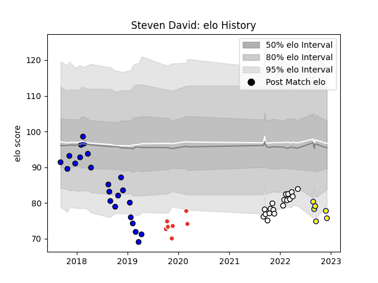

---  
layout: page  
title: Steven David  
date: 2022-12-18 16:28:08.128601  
categories: player  
---
# Steven David

## Positions: FL

## Current elo: 74.0

## Current Percentile: 3.0

# Elo History

# Match History

| Team                       |   Appearances |   Win Rate |
|:---------------------------|--------------:|-----------:|
| Massy                      |            23 |   0.217391 |
| Valence Romans Drome Rugby |            18 |   0.722222 |
| Biarritz Olympique         |             7 |   0.785714 |
| Nevers                     |             7 |   0.5      |

| Opponent                   |   Matches |   Win Rate |
|:---------------------------|----------:|-----------:|
| Mont-de-Marsan             |         5 |   0.2      |
| Soyaux-Angouleme           |         4 |   0.75     |
| Beziers                    |         4 |   0.5      |
| Nevers                     |         4 |   0.25     |
| Dax                        |         3 |   0.333333 |
| Biarritz Olympique         |         3 |   0.5      |
| Albi                       |         2 |   0.5      |
| Provence Rugby             |         2 |   1        |
| Montauban                  |         2 |   0        |
| Massy                      |         2 |   0.5      |
| Aubenas                    |         2 |   1        |
| Vannes                     |         2 |   0.5      |
| Chambery                   |         2 |   1        |
| Bourgoin-Jallieu           |         2 |   0.5      |
| Bayonne                    |         2 |   0        |
| Colomiers                  |         1 |   0        |
| Rouen                      |         1 |   1        |
| US Bressane                |         1 |   0        |
| Tarbes                     |         1 |   1        |
| Suresnes                   |         1 |   1        |
| Aurillac                   |         1 |   0        |
| Roval Drome XV             |         1 |   1        |
| Oyonnax                    |         1 |   0        |
| Cognac Saint Jean d'Angély |         1 |   1        |
| Nice                       |         1 |   1        |
| Blagnac                    |         1 |   1        |
| Brive                      |         1 |   0        |
| Carcassonne                |         1 |   0        |
| Grenoble                   |         1 |   0.5      |