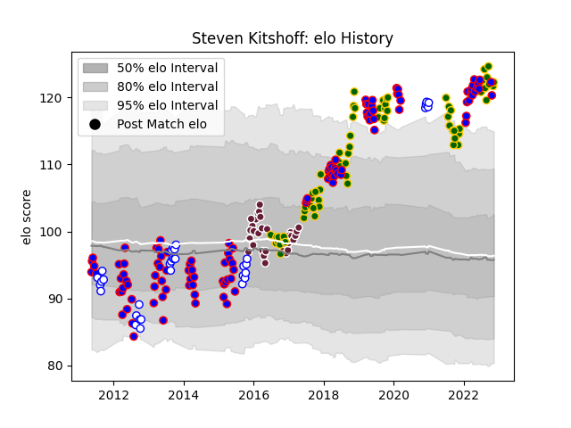

---  
layout: page  
title: Steven Kitshoff  
date: 2022-12-18 16:26:16.508707  
categories: player  
---
# Steven Kitshoff

## Positions: P

## Country: South Africa

## Current elo: 124.0

## Current Percentile: 98.0

# Elo History

# Match History

| Team             |   Appearances |   Win Rate |
|:-----------------|--------------:|-----------:|
| Stormers         |           116 |   0.603448 |
| South Africa     |            70 |   0.592857 |
| Bordeaux Begles  |            34 |   0.529412 |
| Western Province |            34 |   0.691176 |

| Opponent                 |   Matches |   Win Rate |
|:-------------------------|----------:|-----------:|
| Bulls                    |        14 |   0.785714 |
| Sharks                   |        12 |   0.458333 |
| New Zealand              |        12 |   0.291667 |
| Argentina                |        10 |   0.8      |
| Lions                    |        10 |   0.55     |
| Australia                |        10 |   0.4      |
| Wales                    |         8 |   0.5      |
| Griquas                  |         8 |   0.9375   |
| England                  |         8 |   0.5      |
| Golden Lions             |         8 |   0.3125   |
| Blues                    |         7 |   0.571429 |
| Blue Bulls               |         7 |   0.5      |
| Cheetahs                 |         7 |   0.714286 |
| Brumbies                 |         6 |   0.5      |
| France                   |         6 |   0.833333 |
| Clermont Auvergne        |         6 |   0.25     |
| Hurricanes               |         6 |   0.666667 |
| Melbourne Rebels         |         5 |   0.8      |
| Queensland Reds          |         5 |   0.6      |
| Jaguares                 |         5 |   0.6      |
| Highlanders              |         5 |   0.6      |
| New South Wales Waratahs |         5 |   0.4      |
| Chiefs                   |         5 |   0.2      |
| Crusaders                |         5 |   0.1      |
| Free State Cheetahs      |         4 |   1        |
| Natal Sharks             |         4 |   0.75     |
| British and Irish Lions  |         3 |   0.666667 |
| Ulster                   |         3 |   1        |
| Ospreys                  |         3 |   0.833333 |
| Pau                      |         3 |   0.666667 |
| Italy                    |         3 |   1        |
| Ireland                  |         3 |   0.333333 |
| Stade Francais Paris     |         3 |   1        |
| Grenoble                 |         3 |   1        |
| Scotland                 |         2 |   1        |
| Sunwolves                |         2 |   1        |
| Pumas                    |         2 |   1        |
| Toulon                   |         2 |   0.5      |
| Southern Kings           |         2 |   1        |
| Racing 92                |         2 |   0        |
| Stade Toulousain         |         2 |   0.75     |
| Western Force            |         2 |   1        |
| Exeter Chiefs            |         2 |   0.5      |
| Brive                    |         2 |   0.5      |
| Cardiff Blues            |         2 |   0.5      |
| Castres Olympique        |         2 |   0        |
| Japan                    |         2 |   1        |
| Montpellier Herault      |         2 |   0        |
| Namibia                  |         1 |   1        |
| Canada                   |         1 |   1        |
| Connacht                 |         1 |   0        |
| Eastern Province Kings   |         1 |   1        |
| Edinburgh                |         1 |   1        |
| Georgia                  |         1 |   1        |
| Scarlets                 |         1 |   1        |
| Glasgow Warriors         |         1 |   1        |
| La Rochelle              |         1 |   0        |
| Leinster                 |         1 |   1        |
| Oyonnax                  |         1 |   1        |
| London Irish             |         1 |   1        |
| Lyon                     |         1 |   0        |
| Agen                     |         1 |   1        |