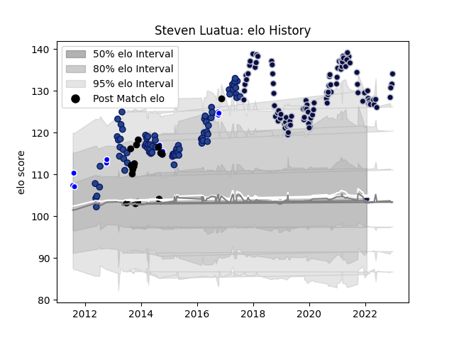

---  
layout: page  
title: Steven Luatua  
date: 2023-01-06 00:22:33.077379  
categories: player  
---
# Steven Luatua

## Positions: FL, N8

## Country: New Zealand

## Current elo: 104.0

## Current Percentile: 94.0

# Elo History

# Match History

| Team          |   Appearances |   Win Rate |
|:--------------|--------------:|-----------:|
| Bristol Rugby |            99 |   0.641414 |
| Blues         |            75 |   0.453333 |
| New Zealand   |            16 |   0.90625  |
| Auckland      |            13 |   0.653846 |

| Opponent                 |   Matches |   Win Rate |
|:-------------------------|----------:|-----------:|
| Chiefs                   |         9 |  0.0555556 |
| Harlequins               |         9 |  0.555556  |
| Leicester Tigers         |         9 |  0.611111  |
| Hurricanes               |         8 |  0.375     |
| Bath Rugby               |         8 |  0.75      |
| Crusaders                |         8 |  0.25      |
| Wasps                    |         7 |  0.285714  |
| Gloucester Rugby         |         7 |  0.714286  |
| Highlanders              |         7 |  0.428571  |
| Exeter Chiefs            |         6 |  0.5       |
| Sale Sharks              |         5 |  0.3       |
| Saracens                 |         5 |  0.4       |
| New South Wales Waratahs |         5 |  0.6       |
| Brumbies                 |         5 |  0.8       |
| Australia                |         5 |  0.9       |
| Worcester Warriors       |         5 |  0.4       |
| Northampton Saints       |         5 |  0.8       |
| Newcastle Falcons        |         4 |  1         |
| Melbourne Rebels         |         4 |  0.75      |
| Lions                    |         4 |  0.25      |
| Queensland Reds          |         4 |  0.625     |
| Cheetahs                 |         4 |  0.5       |
| South Africa             |         4 |  0.75      |
| Western Force            |         4 |  1         |
| Sharks                   |         3 |  0.333333  |
| Stormers                 |         3 |  0.333333  |
| Tasman                   |         3 |  0.166667  |
| London Irish             |         3 |  0.333333  |
| Zebre                    |         3 |  0.5       |
| Bulls                    |         3 |  0.333333  |
| Argentina                |         2 |  1         |
| Brive                    |         2 |  1         |
| Stade Francais Paris     |         2 |  1         |
| Jersey                   |         2 |  0.5       |
| Ealing Trailfinders      |         2 |  1         |
| Richmond                 |         2 |  1         |
| Otago                    |         2 |  1         |
| Northland                |         2 |  1         |
| North Harbour            |         2 |  1         |
| London Scottish          |         2 |  1         |
| Toulon                   |         1 |  1         |
| Southern Kings           |         1 |  1         |
| British and Irish Lions  |         1 |  1         |
| Taranaki                 |         1 |  0         |
| Sunwolves                |         1 |  0         |
| Wellington               |         1 |  1         |
| Bordeaux Begles          |         1 |  1         |
| Bedford                  |         1 |  1         |
| Yorkshire Carnegie       |         1 |  1         |
| Southland                |         1 |  1         |
| La Rochelle              |         1 |  0         |
| Canterbury               |         1 |  0         |
| Cornish Pirates          |         1 |  1         |
| Scarlets                 |         1 |  1         |
| England                  |         1 |  1         |
| Perpignan                |         1 |  1         |
| Nottingham               |         1 |  1         |
| France                   |         1 |  1         |
| Hartpury College         |         1 |  1         |
| Ireland                  |         1 |  1         |
| Italy                    |         1 |  1         |
| Jaguares                 |         1 |  1         |
| Japan                    |         1 |  1         |
| Dragons                  |         1 |  1         |