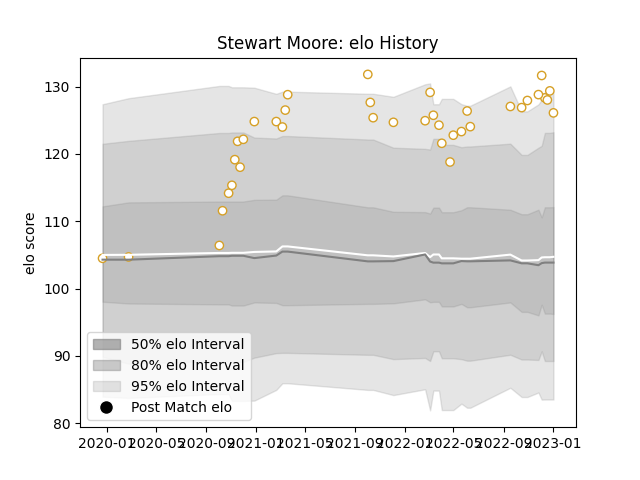

---  
layout: page  
title: Stewart Moore  
date: 2022-12-14 11:36:02.684354  
categories: player  
---
# Stewart Moore

## Positions: C, FB

## Current elo: 112.0

## Current Percentile: 92.0

# Elo History

# Match History

| Team   |   Appearances |   Win Rate |
|:-------|--------------:|-----------:|
| Ulster |            35 |   0.742857 |

| Opponent         |   Matches |   Win Rate |
|:-----------------|----------:|-----------:|
| Leinster         |         4 |   0.25     |
| Zebre            |         4 |   1        |
| Dragons          |         3 |   1        |
| Munster          |         3 |   0.666667 |
| Cardiff Blues    |         2 |   1        |
| Connacht         |         2 |   1        |
| Edinburgh        |         2 |   1        |
| Glasgow Warriors |         2 |   1        |
| Lions            |         2 |   1        |
| Ospreys          |         2 |   0.5      |
| Stormers         |         2 |   0        |
| Benetton Treviso |         2 |   1        |
| Cheetahs         |         1 |   1        |
| Bulls            |         1 |   0        |
| Sale Sharks      |         1 |   0        |
| Scarlets         |         1 |   1        |
| Sharks           |         1 |   1        |