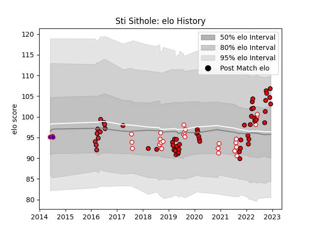

---  
layout: page  
title: Sti Sithole  
date: 2023-02-04 17:27:28.630206  
categories: player  
---
# Sti Sithole

## Positions: P

## Current elo: 89.0

## Current Percentile: 23.0

# Elo History

# Match History

| Team                |   Appearances |   Win Rate |
|:--------------------|--------------:|-----------:|
| Lions               |            50 |  0.49      |
| Golden Lions        |            34 |  0.514706  |
| Griquas             |            16 |  0.3125    |
| Carqueiranne-Hyères |            15 |  0.333333  |
| Southern Kings      |            11 |  0.0909091 |
| Pumas               |             4 |  0.5       |
| Stormers            |             3 |  0.666667  |
| Olimpia Lions       |             1 |  0         |
| Western Province    |             1 |  1         |

| Opponent                   |   Matches |   Win Rate |
|:---------------------------|----------:|-----------:|
| Blue Bulls                 |        12 |   0.166667 |
| Natal Sharks               |        10 |   0.1      |
| Bulls                      |         9 |   0.222222 |
| Griquas                    |         9 |   0.888889 |
| Sharks                     |         8 |   0.125    |
| Western Province           |         8 |   0.5      |
| Free State Cheetahs        |         6 |   0.75     |
| Pumas                      |         6 |   0.666667 |
| Stormers                   |         5 |   0.4      |
| Sunwolves                  |         3 |   1        |
| Dragons                    |         3 |   0.833333 |
| Melbourne Rebels           |         2 |   0.5      |
| Edinburgh                  |         2 |   1        |
| Scarlets                   |         2 |   0.5      |
| Highlanders                |         2 |   0.5      |
| Ospreys                    |         2 |   1        |
| Golden Lions               |         2 |   0        |
| New South Wales Waratahs   |         2 |   0.5      |
| Crusaders                  |         2 |   0        |
| Chiefs                     |         2 |   0.5      |
| Suresnes                   |         2 |   0.5      |
| Cardiff Blues              |         2 |   1        |
| Ulster                     |         2 |   0        |
| Bourgoin-Jallieu           |         2 |   0        |
| Valence Romans Drome Rugby |         2 |   0        |
| Blues                      |         2 |   0        |
| Nice                       |         1 |   0        |
| Stade Francais Paris       |         1 |   1        |
| Southern Kings             |         1 |   1        |
| Tarbes                     |         1 |   1        |
| US Bressane                |         1 |   0        |
| Rennes                     |         1 |   0        |
| Queensland Reds            |         1 |   1        |
| Albi                       |         1 |   1        |
| Jaguares                   |         1 |   0        |
| Narbonne                   |         1 |   0        |
| Cognac Saint Jean d'Angély |         1 |   1        |
| Blagnac                    |         1 |   0        |
| Boland Cavaliers           |         1 |   1        |
| Brumbies                   |         1 |   0        |
| Ceibos Rugby               |         1 |   0        |
| Chambery                   |         1 |   1        |
| Cheetahs                   |         1 |   0        |
| Connacht                   |         1 |   0        |
| Munster                    |         1 |   1        |
| Glasgow Warriors           |         1 |   0        |
| Griffons                   |         1 |   1        |
| Hurricanes                 |         1 |   0        |
| Benetton Treviso           |         1 |   1        |
| Leinster                   |         1 |   0        |
| Lions                      |         1 |   0        |
| Zebre                      |         1 |   1        |