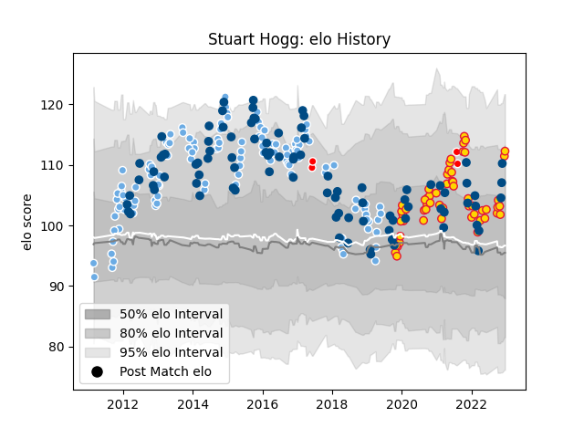

---  
layout: page  
title: Stuart Hogg  
date: 2023-03-17 17:01:12.557697  
categories: player  
---
# Stuart Hogg

## Positions: FB

## Country: Scotland

## Current elo: 105.0

## Current Percentile: 81.0

# Elo History

# Match History

| Team                    |   Appearances |   Win Rate |
|:------------------------|--------------:|-----------:|
| Glasgow Warriors        |           122 |   0.598361 |
| Scotland                |            99 |   0.484848 |
| Exeter Chiefs           |            66 |   0.75     |
| British and Irish Lions |             4 |   0.75     |

| Opponent                 |   Matches |   Win Rate |
|:-------------------------|----------:|-----------:|
| Edinburgh                |        15 |   0.5      |
| Leinster                 |        13 |   0.423077 |
| Ireland                  |        13 |   0.153846 |
| France                   |        13 |   0.384615 |
| Munster                  |        12 |   0.416667 |
| Italy                    |        12 |   0.833333 |
| Ulster                   |        12 |   0.583333 |
| Wales                    |        11 |   0.272727 |
| Benetton Treviso         |        10 |   0.9      |
| Connacht                 |        10 |   0.8      |
| England                  |        10 |   0.4      |
| Bath Rugby               |         9 |   0.777778 |
| South Africa             |         8 |   0.125    |
| Sale Sharks              |         8 |   0.875    |
| Cardiff Blues            |         8 |   0.625    |
| Northampton Saints       |         7 |   0.428571 |
| Saracens                 |         7 |   0.285714 |
| Argentina                |         6 |   1        |
| Montpellier Herault      |         5 |   0.7      |
| Ospreys                  |         5 |   0.6      |
| Racing 92                |         5 |   0.8      |
| Glasgow Warriors         |         5 |   0.7      |
| Gloucester Rugby         |         5 |   0.8      |
| Samoa                    |         5 |   1        |
| Worcester Warriors       |         5 |   1        |
| Japan                    |         5 |   0.8      |
| Bristol Rugby            |         5 |   0.6      |
| Dragons                  |         4 |   0.625    |
| New Zealand              |         4 |   0        |
| Australia                |         4 |   0.25     |
| Scarlets                 |         4 |   0.5      |
| London Irish             |         4 |   0.5      |
| Harlequins               |         4 |   0.5      |
| Leicester Tigers         |         4 |   1        |
| United States of America |         3 |   0.666667 |
| Wasps                    |         3 |   1        |
| Stade Toulousain         |         3 |   0.333333 |
| Zebre                    |         3 |   1        |
| Fiji                     |         3 |   1        |
| Lyon                     |         2 |   1        |
| La Rochelle              |         2 |   1        |
| Tonga                    |         2 |   0.5      |
| Exeter Chiefs            |         2 |   1        |
| Castres Olympique        |         2 |   0.5      |
| Provincial Union XV      |         1 |   1        |
| Newcastle Falcons        |         1 |   1        |
| Georgia                  |         1 |   1        |
| Southern Kings           |         1 |   1        |
| Toulon                   |         1 |   0        |
| Crusaders                |         1 |   1        |
| Canada                   |         1 |   1        |
| Bulls                    |         1 |   1        |
| Aironi                   |         1 |   1        |