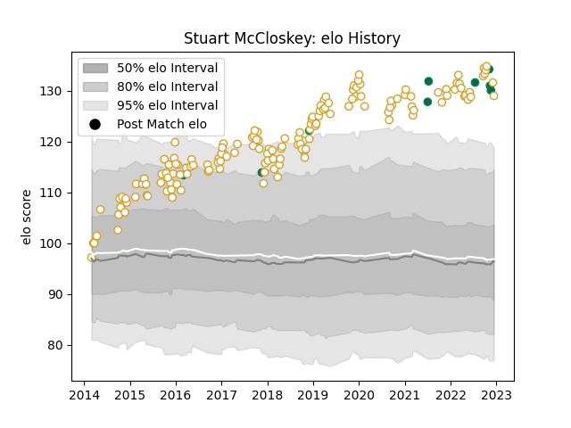

---  
layout: page  
title: Stuart McCloskey  
date: 2023-02-02 19:08:47.645543  
categories: player  
---
# Stuart McCloskey

## Positions: C

## Country: Ireland

## Current elo: 138.0

## Current Percentile: 98.0

# Elo History

# Match History

| Team    |   Appearances |   Win Rate |
|:--------|--------------:|-----------:|
| Ulster  |           156 |   0.644231 |
| Ireland |             9 |   0.888889 |

| Opponent                 |   Matches |   Win Rate |
|:-------------------------|----------:|-----------:|
| Leinster                 |        17 |   0.294118 |
| Munster                  |        15 |   0.466667 |
| Connacht                 |        15 |   0.733333 |
| Edinburgh                |        12 |   0.833333 |
| Scarlets                 |        11 |   0.727273 |
| Glasgow Warriors         |        11 |   0.545455 |
| Dragons                  |        10 |   0.95     |
| Ospreys                  |        10 |   0.8      |
| Benetton Treviso         |         7 |   0.785714 |
| Cardiff Blues            |         6 |   0.833333 |
| Clermont Auvergne        |         4 |   0.5      |
| Southern Kings           |         4 |   1        |
| Harlequins               |         4 |   1        |
| Leicester Tigers         |         3 |   0.666667 |
| La Rochelle              |         3 |   0.333333 |
| Stade Toulousain         |         3 |   0.666667 |
| Stormers                 |         2 |   0        |
| United States of America |         2 |   1        |
| Saracens                 |         2 |   0        |
| Sale Sharks              |         2 |   0.5      |
| Wasps                    |         2 |   0.5      |
| Racing 92                |         2 |   0.5      |
| Zebre                    |         2 |   0.5      |
| Bath Rugby               |         2 |   1        |
| Fiji                     |         2 |   1        |
| Cheetahs                 |         2 |   0.75     |
| Oyonnax                  |         1 |   1        |
| New Zealand Maori        |         1 |   1        |
| Lions                    |         1 |   1        |
| Japan                    |         1 |   1        |
| Sharks                   |         1 |   1        |
| South Africa             |         1 |   1        |
| Exeter Chiefs            |         1 |   0        |
| England                  |         1 |   0        |
| Bordeaux Begles          |         1 |   0        |
| Australia                |         1 |   1        |