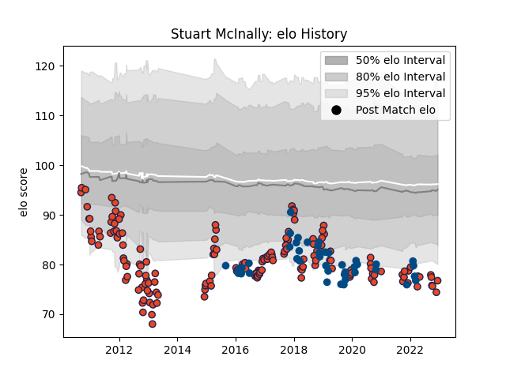

---  
layout: page  
title: Stuart McInally  
date: 2023-03-06 11:27:14.062909  
categories: player  
---
# Stuart McInally

## Positions: H, FL

## Country: Scotland

## Current elo: 100.0

## Current Percentile: 4.0

# Elo History

# Match History

| Team      |   Appearances |   Win Rate |
|:----------|--------------:|-----------:|
| Edinburgh |           170 |   0.476471 |
| Scotland  |            46 |   0.576087 |

| Opponent             |   Matches |   Win Rate |
|:---------------------|----------:|-----------:|
| Glasgow Warriors     |        17 |   0.470588 |
| Benetton Treviso     |        14 |   0.642857 |
| Munster              |        14 |   0.142857 |
| Ulster               |        12 |   0.166667 |
| Scarlets             |        12 |   0.5      |
| Cardiff Blues        |        11 |   0.272727 |
| Dragons              |        11 |   0.545455 |
| Ospreys              |         8 |   0.25     |
| Connacht             |         8 |   0.5      |
| Zebre                |         7 |   0.857143 |
| Leinster             |         7 |   0        |
| Italy                |         7 |   1        |
| France               |         6 |   0.5      |
| Wales                |         6 |   0.166667 |
| Ireland              |         5 |   0        |
| England              |         5 |   0.5      |
| London Irish         |         5 |   1        |
| Japan                |         4 |   0.75     |
| Saracens             |         3 |   0.333333 |
| Racing 92            |         3 |   0.333333 |
| Samoa                |         2 |   1        |
| London Welsh         |         2 |   1        |
| South Africa         |         2 |   0        |
| Stade Francais Paris |         2 |   1        |
| Timisoara Saracens   |         2 |   1        |
| Newcastle Falcons    |         2 |   1        |
| Toulon               |         2 |   1        |
| Wasps                |         2 |   1        |
| Montpellier Herault  |         2 |   0.5      |
| Lions                |         2 |   0        |
| Aironi               |         2 |   0.5      |
| Argentina            |         2 |   1        |
| Gloucester Rugby     |         2 |   0        |
| Georgia              |         2 |   1        |
| La Rochelle          |         2 |   0        |
| Bulls                |         2 |   0.5      |
| Southern Kings       |         1 |   1        |
| Australia            |         1 |   1        |
| Bath Rugby           |         1 |   1        |
| Bordeaux Begles      |         1 |   0        |
| Tonga                |         1 |   1        |
| Brive                |         1 |   1        |
| Stormers             |         1 |   0        |
| Stade Toulousain     |         1 |   1        |
| Cheetahs             |         1 |   1        |
| Castres Olympique    |         1 |   1        |
| Fiji                 |         1 |   1        |
| Sale Sharks          |         1 |   1        |
| Russia               |         1 |   1        |
| Pau                  |         1 |   1        |
| Harlequins           |         1 |   1        |
| Northampton Saints   |         1 |   0        |
| Krasny Yar           |         1 |   1        |
| New Zealand          |         1 |   0        |
| Agen                 |         1 |   1        |