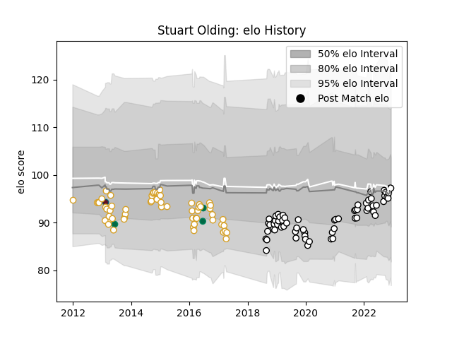

---  
layout: page  
title: Stuart Olding  
date: 2022-12-12 15:27:46.994382  
categories: player  
---
# Stuart Olding

## Positions: C, FH

## Country: Ireland

## Current elo: 97.0

## Current Percentile: 52.0

# Elo History

# Match History

| Team    |   Appearances |   Win Rate |
|:--------|--------------:|-----------:|
| Brive   |            64 |   0.539062 |
| Ulster  |            62 |   0.669355 |
| Ireland |             3 |   0.333333 |
| Munster |             1 |   1        |

| Opponent                 |   Matches |   Win Rate |
|:-------------------------|----------:|-----------:|
| Zebre                    |         8 |   1        |
| Benetton Treviso         |         6 |   0.916667 |
| Leinster                 |         6 |   0.333333 |
| Toulon                   |         6 |   0.333333 |
| Cardiff Blues            |         6 |   0.75     |
| Ospreys                  |         5 |   0.6      |
| Bayonne                  |         5 |   0.5      |
| Montpellier Herault      |         5 |   0.5      |
| Glasgow Warriors         |         5 |   0.6      |
| Scarlets                 |         5 |   0.7      |
| Edinburgh                |         5 |   0.8      |
| Racing 92                |         4 |   0        |
| Dragons                  |         4 |   1        |
| Pau                      |         4 |   0.5      |
| Connacht                 |         3 |   1        |
| Stade Francais Paris     |         3 |   1        |
| La Rochelle              |         3 |   0        |
| Biarritz Olympique       |         3 |   0.833333 |
| Lyon                     |         3 |   0.333333 |
| Perpignan                |         3 |   0.666667 |
| Munster                  |         3 |   0        |
| South Africa             |         2 |   0        |
| Soyaux-Angouleme         |         2 |   1        |
| Stade Toulousain         |         2 |   0        |
| Provence Rugby           |         2 |   0.5      |
| US Bressane              |         2 |   0.5      |
| Agen                     |         2 |   0.5      |
| Mont-de-Marsan           |         2 |   0.5      |
| Leicester Tigers         |         2 |   0.5      |
| Colomiers                |         2 |   0.5      |
| Clermont Auvergne        |         2 |   0.5      |
| Castres Olympique        |         2 |   1        |
| Bordeaux Begles          |         2 |   0        |
| Beziers                  |         2 |   0.5      |
| Oyonnax                  |         1 |   1        |
| Nevers                   |         1 |   1        |
| Aurillac                 |         1 |   1        |
| Saracens                 |         1 |   0        |
| Exeter Chiefs            |         1 |   1        |
| Carcassonne              |         1 |   1        |
| United States of America |         1 |   1        |
| Vannes                   |         1 |   1        |
| Massy                    |         1 |   1        |