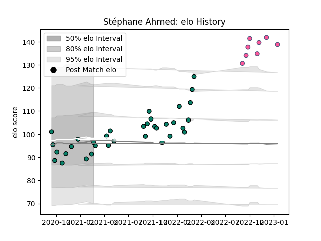

---  
layout: page  
title: Stéphane Ahmed  
date: 2022-12-12 15:01:25.063111  
categories: player  
---
# Stéphane Ahmed

## Positions: W

## Current elo: 119.0

## Current Percentile: 94.0

# Elo History

# Match History

| Team                 |   Appearances |   Win Rate |
|:---------------------|--------------:|-----------:|
| Montauban            |            32 |   0.546875 |
| Stade Francais Paris |             7 |   0.5      |

| Opponent                   |   Matches |   Win Rate |
|:---------------------------|----------:|-----------:|
| Mont-de-Marsan             |         3 |   0.666667 |
| Colomiers                  |         3 |   0.333333 |
| Oyonnax                    |         3 |   0.333333 |
| Aurillac                   |         3 |   0.666667 |
| US Bressane                |         2 |   0.75     |
| Provence Rugby             |         2 |   0        |
| Nevers                     |         2 |   1        |
| Grenoble                   |         2 |   0.5      |
| Vannes                     |         2 |   0.5      |
| Carcassonne                |         2 |   0.5      |
| Biarritz Olympique         |         2 |   0.5      |
| Clermont Auvergne          |         1 |   1        |
| La Rochelle                |         1 |   1        |
| Lyon                       |         1 |   0        |
| Montpellier Herault        |         1 |   0        |
| Narbonne                   |         1 |   1        |
| Bordeaux Begles            |         1 |   0        |
| Perpignan                  |         1 |   0        |
| Beziers                    |         1 |   1        |
| Soyaux-Angouleme           |         1 |   1        |
| Stade Toulousain           |         1 |   0.5      |
| Bayonne                    |         1 |   1        |
| Valence Romans Drome Rugby |         1 |   1        |
| Agen                       |         1 |   0        |