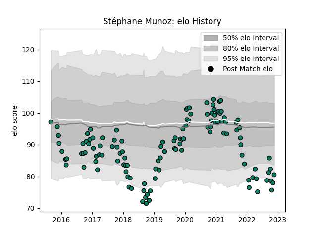

---  
layout: page  
title: Stéphane Munoz  
date: 2023-02-02 18:58:15.714046  
categories: player  
---
# Stéphane Munoz

## Positions: FL

## Current elo: 97.0

## Current Percentile: 1.0

# Elo History

# Match History

| Team      |   Appearances |   Win Rate |
|:----------|--------------:|-----------:|
| Montauban |           164 |   0.521341 |

| Opponent                   |   Matches |   Win Rate |
|:---------------------------|----------:|-----------:|
| Beziers                    |        12 |   0.333333 |
| Aurillac                   |        11 |   0.5      |
| Soyaux-Angouleme           |        11 |   0.681818 |
| Vannes                     |        10 |   0.55     |
| Carcassonne                |        10 |   0.5      |
| Nevers                     |        10 |   0.6      |
| Mont-de-Marsan             |        10 |   0.5      |
| Perpignan                  |        10 |   0.4      |
| Colomiers                  |        10 |   0.6      |
| Biarritz Olympique         |         9 |   0.444444 |
| Narbonne                   |         7 |   0.714286 |
| Dax                        |         6 |   0.666667 |
| Grenoble                   |         6 |   0.333333 |
| Provence Rugby             |         6 |   0.5      |
| Oyonnax                    |         6 |   0.416667 |
| Rouen                      |         4 |   0.75     |
| Albi                       |         4 |   1        |
| US Bressane                |         4 |   0.625    |
| Agen                       |         3 |   0        |
| Massy                      |         3 |   0.666667 |
| Lyon                       |         2 |   0        |
| Brive                      |         2 |   0.5      |
| Roval Drome XV             |         2 |   1        |
| Bourgoin-Jallieu           |         2 |   0.5      |
| Bayonne                    |         2 |   0        |
| Valence Romans Drome Rugby |         2 |   0.5      |