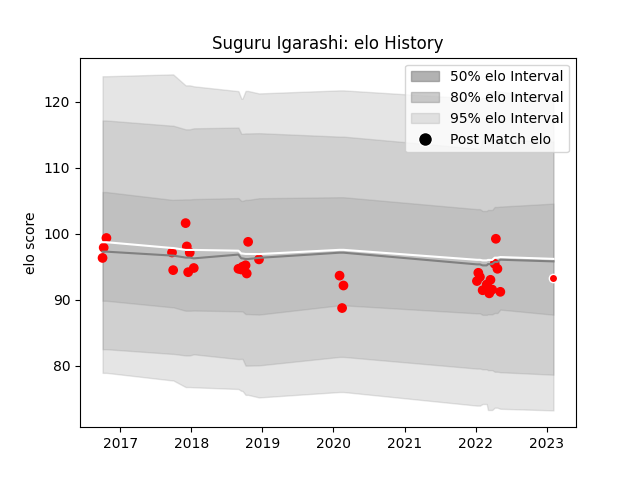

---  
layout: page  
title: Suguru Igarashi  
date: 2023-02-09 13:56:11.772559  
categories: player  
---
# Suguru Igarashi

## Positions: P

## Current elo: 93.0

## Current Percentile: 34.0

# Elo History

# Match History

| Team                  |   Appearances |   Win Rate |
|:----------------------|--------------:|-----------:|
| Yokohama Canon Eagles |            33 |   0.424242 |
| Kobelco Kobe Steelers |             1 |   1        |

| Opponent                          |   Matches |   Win Rate |
|:----------------------------------|----------:|-----------:|
| Saitama Wild Knights              |         5 |   0        |
| Black Rams Tokyo                  |         3 |   0.333333 |
| Green Rockets Tokatsu             |         3 |   0.666667 |
| Kubota Spears Funabashi Tokyo-Bay |         3 |   0.333333 |
| Toshiba Brave Lupus Tokyo         |         3 |   0.333333 |
| Urayasu D-Rocks                   |         3 |   0.333333 |
| Coca-Cola Red Sparks              |         2 |   1        |
| Shizuoka Blue Revs                |         2 |   0        |
| Tokyo Sungoliath                  |         2 |   0        |
| Toyota Industries Shuttles Aichi  |         2 |   1        |
| Kobelco Kobe Steelers             |         1 |   1        |
| Mie Honda Heat                    |         1 |   0        |
| Mitsubishi Dynaboars              |         1 |   1        |
| Munakata Sanix Blues              |         1 |   1        |
| NTT Docomo Red Hurricanes Osaka   |         1 |   1        |
| Toyota Verblitz                   |         1 |   1        |