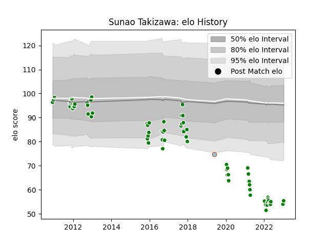

---  
layout: page  
title: Sunao Takizawa  
date: 2022-12-28 12:56:37.410247  
categories: player  
---
# Sunao Takizawa

## Positions: P

## Current elo: 61.0

## Current Percentile: 0.0

# Elo History

# Match History

| Team                  |   Appearances |   Win Rate |
|:----------------------|--------------:|-----------:|
| Green Rockets Tokatsu |            71 |   0.330986 |
| Austin Elite Rugby    |             1 |   0        |

| Opponent                          |   Matches |   Win Rate |
|:----------------------------------|----------:|-----------:|
| Black Rams Tokyo                  |         7 |   0.142857 |
| Yokohama Canon Eagles             |         7 |   0.285714 |
| Saitama Wild Knights              |         6 |   0        |
| Shizuoka Blue Revs                |         6 |   0.166667 |
| Munakata Sanix Blues              |         5 |   0.8      |
| Kobelco Kobe Steelers             |         5 |   0        |
| Urayasu D-Rocks                   |         4 |   0.5      |
| Toyota Verblitz                   |         4 |   0.5      |
| Toyota Industries Shuttles Aichi  |         4 |   0.75     |
| Tokyo Sungoliath                  |         4 |   0        |
| NTT Docomo Red Hurricanes Osaka   |         4 |   0.375    |
| Coca-Cola Red Sparks              |         3 |   1        |
| Toshiba Brave Lupus Tokyo         |         3 |   0.333333 |
| Kubota Spears Funabashi Tokyo-Bay |         3 |   0.333333 |
| Hino Red Dolphins                 |         2 |   0        |
| Hanazono Kintetsu Liners          |         2 |   0.5      |
| Mitsubishi Dynaboars              |         1 |   0        |
| Mie Honda Heat                    |         1 |   1        |
| Houston SaberCats                 |         1 |   0        |