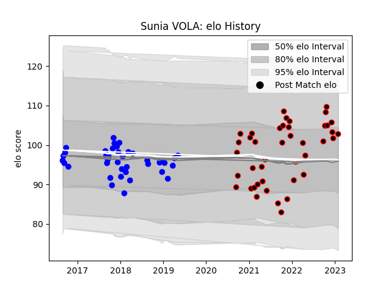

---  
layout: page  
title: Sunia VOLA  
date: 2023-03-29 11:29:51.722581  
categories: player  
---
# Sunia VOLA

Last updated: 2023-03-29
## Positions: P

## Current elo: 101.0

## Current Percentile: 59.0

# Elo History

# Match History

| Team   |   Appearances |   Win Rate |
|:-------|--------------:|-----------:|
| Nice   |            46 |   0.652174 |
| Vannes |            39 |   0.474359 |

| Opponent                   |   Matches |   Win Rate |
|:---------------------------|----------:|-----------:|
| Soyaux-Angouleme           |         5 |   0.4      |
| US Bressane                |         5 |   0.7      |
| Tarbes                     |         5 |   0.7      |
| Chambery                   |         5 |   0.6      |
| Albi                       |         5 |   0.5      |
| Valence Romans Drome Rugby |         4 |   0.25     |
| Narbonne                   |         4 |   0        |
| Bourgoin-Jallieu           |         4 |   0.875    |
| Suresnes                   |         4 |   0.75     |
| Massy                      |         4 |   0.75     |
| Dax                        |         3 |   0.333333 |
| Nevers                     |         3 |   0.333333 |
| Montauban                  |         3 |   0.666667 |
| Mont-de-Marsan             |         3 |   0.666667 |
| Cognac Saint Jean d'Angély |         3 |   0.666667 |
| Aubenas                    |         3 |   1        |
| Colomiers                  |         2 |   0        |
| Grenoble                   |         2 |   0        |
| Carcassonne                |         2 |   0.5      |
| Biarritz Olympique         |         2 |   1        |
| Bayonne                    |         2 |   0.5      |
| Aurillac                   |         2 |   0.5      |
| Perpignan                  |         2 |   0.5      |
| Rennes                     |         1 |   1        |
| Agen                       |         1 |   0.5      |
| Provence Rugby             |         1 |   1        |
| Oyonnax                    |         1 |   0        |
| Carqueiranne-Hyères        |         1 |   1        |
| Blagnac                    |         1 |   1        |
| Beziers                    |         1 |   1        |
| Dijon                      |         1 |   1        |