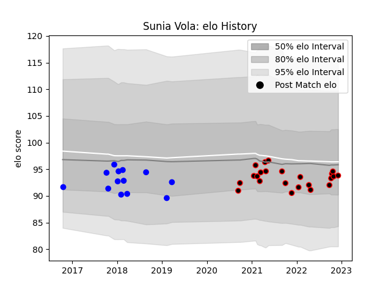

---  
layout: page  
title: Sunia Vola  
date: 2022-12-18 16:17:56.968963  
categories: player  
---
# Sunia Vola

## Positions: P

## Current elo: 93.0

## Current Percentile: 39.0

# Elo History

# Match History

| Team   |   Appearances |   Win Rate |
|:-------|--------------:|-----------:|
| Nice   |            24 |   0.625    |
| Vannes |            13 |   0.307692 |

| Opponent                   |   Matches |   Win Rate |
|:---------------------------|----------:|-----------:|
| Albi                       |         3 |   0.333333 |
| Chambery                   |         3 |   0.666667 |
| US Bressane                |         3 |   0.666667 |
| Soyaux-Angouleme           |         3 |   0.333333 |
| Valence Romans Drome Rugby |         3 |   0        |
| Colomiers                  |         2 |   0        |
| Grenoble                   |         2 |   0        |
| Massy                      |         2 |   1        |
| Aurillac                   |         2 |   0.5      |
| Bourgoin-Jallieu           |         2 |   1        |
| Suresnes                   |         2 |   1        |
| Narbonne                   |         2 |   0        |
| Carqueiranne-Hyères        |         1 |   1        |
| Cognac Saint Jean d'Angély |         1 |   1        |
| Nevers                     |         1 |   1        |
| Oyonnax                    |         1 |   0        |
| Perpignan                  |         1 |   0        |
| Rennes                     |         1 |   1        |
| Tarbes                     |         1 |   1        |
| Blagnac                    |         1 |   1        |