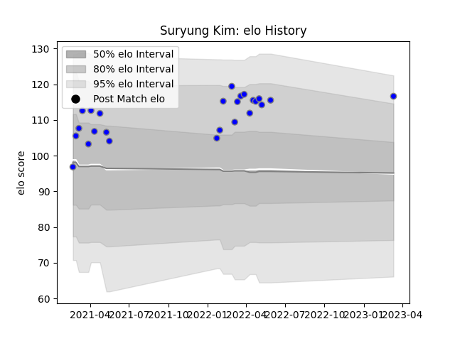

---  
layout: page  
title: Suryung Kim  
date: 2023-03-21 18:49:09.484187  
categories: player  
---
# Suryung Kim

Last updated: 2023-03-21
## Positions: FB, W

## Current elo: 114.0

## Current Percentile: 88.0

# Elo History

# Match History

| Team                              |   Appearances |   Win Rate |
|:----------------------------------|--------------:|-----------:|
| Kubota Spears Funabashi Tokyo-Bay |            26 |   0.730769 |

| Opponent                        |   Matches |   Win Rate |
|:--------------------------------|----------:|-----------:|
| Kobelco Kobe Steelers           |         3 |   0.666667 |
| Shizuoka Blue Revs              |         3 |   1        |
| Tokyo Sungoliath                |         3 |   0        |
| Toshiba Brave Lupus Tokyo       |         3 |   1        |
| Yokohama Canon Eagles           |         3 |   0.666667 |
| Green Rockets Tokatsu           |         2 |   1        |
| Toyota Verblitz                 |         2 |   0.5      |
| Urayasu D-Rocks                 |         2 |   1        |
| Mie Honda Heat                  |         1 |   1        |
| Mitsubishi Dynaboars            |         1 |   1        |
| Munakata Sanix Blues            |         1 |   1        |
| NTT Docomo Red Hurricanes Osaka |         1 |   1        |
| Saitama Wild Knights            |         1 |   0        |