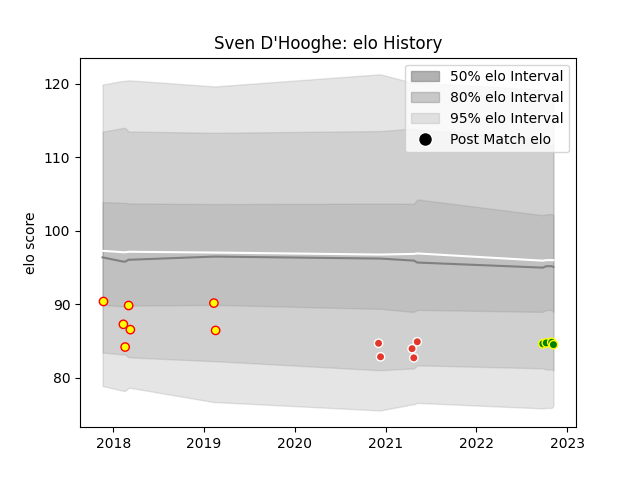

---  
layout: page  
title: Sven D'Hooghe  
date: 2022-12-14 11:30:17.705361  
categories: player  
---
# Sven D'Hooghe

## Positions: L

## Country: Belgium

## Current elo: 83.0

## Current Percentile: 12.0

# Elo History

# Match History

| Team                |   Appearances |   Win Rate |
|:--------------------|--------------:|-----------:|
| Carqueiranne-Hyères |             8 |   0.25     |
| Belgium             |             7 |   0.285714 |
| Biarritz Olympique  |             5 |   0.5      |

| Opponent                   |   Matches |   Win Rate |
|:---------------------------|----------:|-----------:|
| Russia                     |         2 |       0    |
| Germany                    |         2 |       1    |
| Mont-de-Marsan             |         2 |       0.25 |
| Aurillac                   |         1 |       1    |
| Nice                       |         1 |       0    |
| Tarbes                     |         1 |       1    |
| Soyaux-Angouleme           |         1 |       1    |
| Romania                    |         1 |       0    |
| Rennes                     |         1 |       0    |
| Narbonne                   |         1 |       0    |
| Nevers                     |         1 |       0    |
| Blagnac                    |         1 |       0    |
| Georgia                    |         1 |       0    |
| Dax                        |         1 |       0    |
| Cognac Saint Jean d'Angély |         1 |       1    |
| Brazil                     |         1 |       0    |
| Valence Romans Drome Rugby |         1 |       0    |