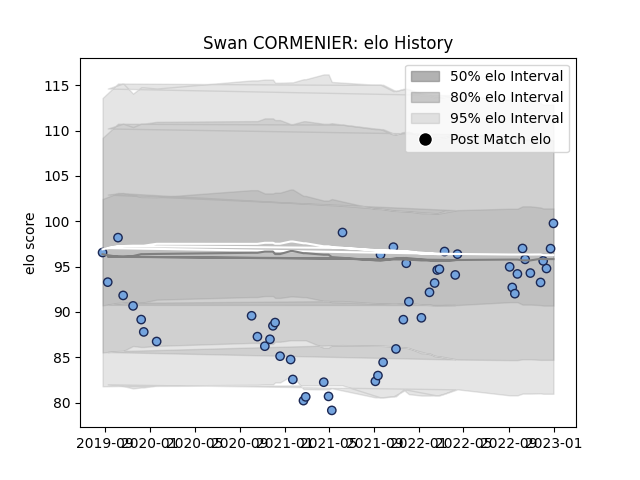

---  
layout: page  
title: Swan CORMENIER  
date: 2023-03-02 11:25:38.266001  
categories: player  
---
# Swan CORMENIER

## Positions: P

## Current elo: 89.0

## Current Percentile: 31.0

# Elo History

# Match History

| Team    |   Appearances |   Win Rate |
|:--------|--------------:|-----------:|
| Bayonne |            50 |        0.5 |

| Opponent             |   Matches |   Win Rate |
|:---------------------|----------:|-----------:|
| Toulon               |         6 |   0.333333 |
| Stade Francais Paris |         4 |   0.25     |
| Bordeaux Begles      |         3 |   0.333333 |
| Racing 92            |         3 |   0.666667 |
| Oyonnax              |         3 |   0.666667 |
| Agen                 |         2 |   0.75     |
| Narbonne             |         2 |   1        |
| US Bressane          |         2 |   1        |
| Castres Olympique    |         2 |   0        |
| Stade Toulousain     |         2 |   0.5      |
| Scarlets             |         2 |   0        |
| La Rochelle          |         2 |   0.5      |
| Pau                  |         2 |   0        |
| Nevers               |         2 |   0.75     |
| Provence Rugby       |         1 |   1        |
| Montauban            |         1 |   1        |
| Montpellier Herault  |         1 |   0        |
| Aurillac             |         1 |   1        |
| Mont-de-Marsan       |         1 |   1        |
| Lyon                 |         1 |   0        |
| Leicester Tigers     |         1 |   0        |
| Grenoble             |         1 |   1        |
| Colomiers            |         1 |   1        |
| Clermont Auvergne    |         1 |   0        |
| Carcassonne          |         1 |   1        |
| Beziers              |         1 |   0        |
| Vannes               |         1 |   1        |