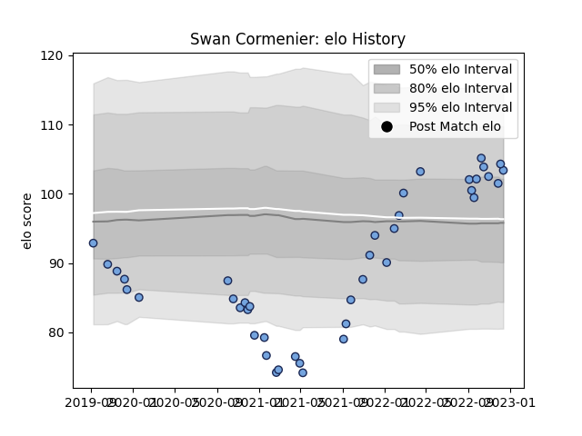

---  
layout: page  
title: Swan Cormenier  
date: 2022-12-09 13:13:19.825458  
categories: player  
---
# Swan Cormenier

## Positions: P

## Current elo: 104.0

## Current Percentile: 75.0

# Elo History

# Match History

| Team    |   Appearances |   Win Rate |
|:--------|--------------:|-----------:|
| Bayonne |            40 |     0.4375 |

| Opponent             |   Matches |   Win Rate |
|:---------------------|----------:|-----------:|
| Toulon               |         6 |   0.333333 |
| Bordeaux Begles      |         3 |   0.333333 |
| Stade Francais Paris |         3 |   0.333333 |
| Castres Olympique    |         2 |   0        |
| Stade Toulousain     |         2 |   0.5      |
| La Rochelle          |         2 |   0.5      |
| Lyon                 |         2 |   0.5      |
| Scarlets             |         2 |   0        |
| Racing 92            |         2 |   0.5      |
| Narbonne             |         2 |   1        |
| Pau                  |         2 |   0        |
| Agen                 |         1 |   0.5      |
| Oyonnax              |         1 |   0        |
| US Bressane          |         1 |   1        |
| Montpellier Herault  |         1 |   0        |
| Nevers               |         1 |   1        |
| Aurillac             |         1 |   1        |
| Montauban            |         1 |   1        |
| Leicester Tigers     |         1 |   0        |
| Grenoble             |         1 |   1        |
| Colomiers            |         1 |   1        |
| Clermont Auvergne    |         1 |   0        |
| Vannes               |         1 |   1        |