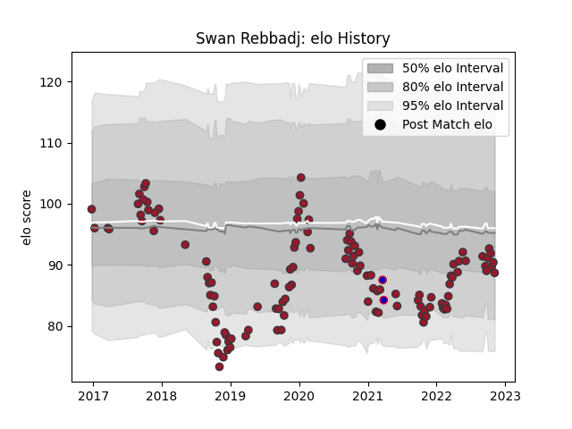

---  
layout: page  
title: Swan Rebbadj  
date: 2022-12-14 11:29:33.490978  
categories: player  
---
# Swan Rebbadj

## Positions: L, FL

## Country: France

## Current elo: 87.0

## Current Percentile: 24.0

# Elo History

# Match History

| Team   |   Appearances |   Win Rate |
|:-------|--------------:|-----------:|
| Toulon |           116 |   0.525862 |
| France |             2 |   0.5      |

| Opponent             |   Matches |   Win Rate |
|:---------------------|----------:|-----------:|
| Racing 92            |         9 |   0.333333 |
| Castres Olympique    |         9 |   0.555556 |
| Montpellier Herault  |         9 |   0.277778 |
| La Rochelle          |         9 |   0.333333 |
| Clermont Auvergne    |         8 |   0.5      |
| Bordeaux Begles      |         8 |   0.375    |
| Pau                  |         8 |   0.6875   |
| Stade Francais Paris |         7 |   0.428571 |
| Brive                |         7 |   0.571429 |
| Lyon                 |         7 |   0.571429 |
| Stade Toulousain     |         6 |   0.583333 |
| Bayonne              |         5 |   0.6      |
| Scarlets             |         4 |   1        |
| Perpignan            |         4 |   0.5      |
| Agen                 |         3 |   1        |
| London Irish         |         2 |   1        |
| Grenoble             |         2 |   0.75     |
| Biarritz Olympique   |         2 |   1        |
| Scotland             |         1 |   0        |
| Leicester Tigers     |         1 |   1        |
| Oyonnax              |         1 |   1        |
| Newcastle Falcons    |         1 |   0        |
| Bath Rugby           |         1 |   0        |
| Edinburgh            |         1 |   0        |
| Bristol Rugby        |         1 |   0        |
| Benetton Treviso     |         1 |   1        |
| Wales                |         1 |   1        |