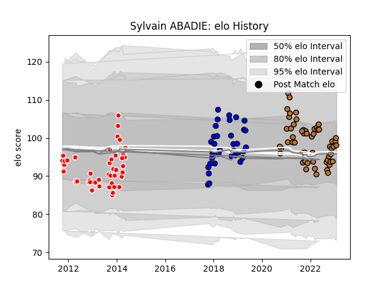

---  
layout: page  
title: Sylvain ABADIE  
date: 2023-02-05 17:56:11.211883  
categories: player  
---
# Sylvain ABADIE

## Positions: P

## Current elo: 98.0

## Current Percentile: 55.0

# Elo History

# Match History

| Team     |   Appearances |   Win Rate |
|:---------|--------------:|-----------:|
| Narbonne |            55 |   0.463636 |
| Auch     |            45 |   0.355556 |
| Massy    |            36 |   0.375    |

| Opponent                   |   Matches |   Win Rate |
|:---------------------------|----------:|-----------:|
| Mont-de-Marsan             |         9 |   0.222222 |
| Tarbes                     |         8 |   0.5      |
| Colomiers                  |         7 |   0.214286 |
| Beziers                    |         7 |   0.285714 |
| US Bressane                |         6 |   0.5      |
| Aurillac                   |         6 |   0.333333 |
| Bayonne                    |         6 |   0        |
| Bourgoin-Jallieu           |         6 |   0.5      |
| Carcassonne                |         6 |   0.5      |
| Albi                       |         6 |   0.25     |
| Vannes                     |         4 |   0.25     |
| Narbonne                   |         4 |   0.625    |
| Montauban                  |         4 |   0        |
| Dax                        |         4 |   0.375    |
| Soyaux-Angouleme           |         4 |   0.375    |
| Pau                        |         4 |   0.25     |
| Suresnes                   |         4 |   0.75     |
| Biarritz Olympique         |         4 |   0.5      |
| Nice                       |         4 |   1        |
| Provence Rugby             |         3 |   1        |
| Blagnac                    |         3 |   0.833333 |
| Nevers                     |         3 |   0.333333 |
| Rouen                      |         2 |   0.5      |
| Perpignan                  |         2 |   0.5      |
| Agen                       |         2 |   1        |
| Oyonnax                    |         2 |   0        |
| La Rochelle                |         2 |   0        |
| Grenoble                   |         2 |   0.5      |
| Cognac Saint Jean d'Angély |         2 |   1        |
| Chambery                   |         2 |   0        |
| Aubenas                    |         2 |   0.5      |
| Lyon                       |         2 |   0        |
| Rennes                     |         1 |   1        |
| Carqueiranne-Hyères        |         1 |   1        |
| Brive                      |         1 |   0        |
| Valence Romans Drome Rugby |         1 |   0        |