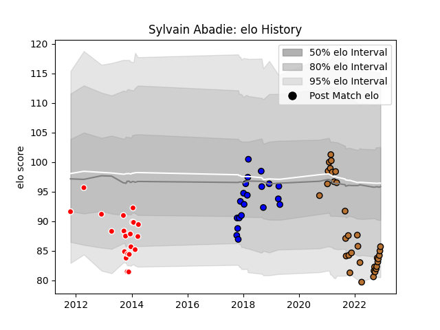

---  
layout: page  
title: Sylvain Abadie  
date: 2022-12-09 13:10:35.254710  
categories: player  
---
# Sylvain Abadie

## Positions: P

## Current elo: 86.0

## Current Percentile: 11.0

# Elo History

# Match History

| Team     |   Appearances |   Win Rate |
|:---------|--------------:|-----------:|
| Narbonne |            34 |   0.455882 |
| Auch     |            21 |   0.309524 |
| Massy    |            20 |   0.35     |

| Opponent                   |   Matches |   Win Rate |
|:---------------------------|----------:|-----------:|
| Mont-de-Marsan             |         5 |   0.2      |
| Bayonne                    |         5 |   0        |
| Colomiers                  |         4 |   0.125    |
| Bourgoin-Jallieu           |         4 |   0.25     |
| Aurillac                   |         3 |   0.333333 |
| Beziers                    |         3 |   0        |
| Tarbes                     |         3 |   0.333333 |
| Suresnes                   |         3 |   0.666667 |
| Albi                       |         3 |   0.166667 |
| Soyaux-Angouleme           |         3 |   0.333333 |
| Nevers                     |         3 |   0.333333 |
| US Bressane                |         3 |   0.666667 |
| Dax                        |         3 |   0.5      |
| Provence Rugby             |         2 |   1        |
| Nice                       |         2 |   1        |
| Narbonne                   |         2 |   0.5      |
| Montauban                  |         2 |   0        |
| Agen                       |         2 |   1        |
| Chambery                   |         2 |   0        |
| Carcassonne                |         2 |   0.5      |
| Blagnac                    |         2 |   0.75     |
| Vannes                     |         2 |   0.5      |
| La Rochelle                |         1 |   0        |
| Grenoble                   |         1 |   1        |
| Cognac Saint Jean d'Angély |         1 |   1        |
| Oyonnax                    |         1 |   0        |
| Pau                        |         1 |   1        |
| Perpignan                  |         1 |   0        |
| Carqueiranne-Hyères        |         1 |   1        |
| Rennes                     |         1 |   1        |
| Rouen                      |         1 |   0        |
| Biarritz Olympique         |         1 |   0        |
| Aubenas                    |         1 |   1        |
| Valence Romans Drome Rugby |         1 |   0        |