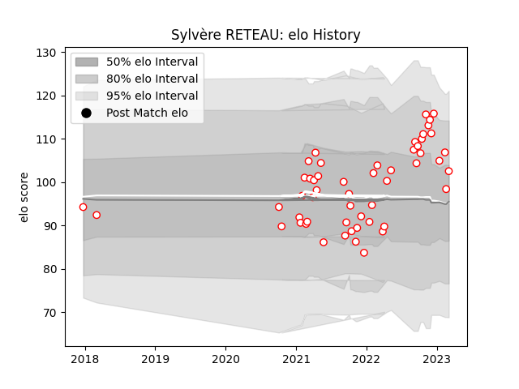

---  
layout: page  
title: Sylvère RETEAU  
date: 2023-02-17 14:41:04.666812  
categories: player  
---
# Sylvère RETEAU

## Positions: C, SH

## Current elo: 109.0

## Current Percentile: 74.0

# Elo History

# Match History

| Team   |   Appearances |   Win Rate |
|:-------|--------------:|-----------:|
| Dax    |            51 |   0.588235 |

| Opponent                   |   Matches |   Win Rate |
|:---------------------------|----------:|-----------:|
| Nice                       |         5 |   0.8      |
| Chambery                   |         5 |   0.8      |
| Blagnac                    |         4 |   0.5      |
| Tarbes                     |         4 |   0.5      |
| Suresnes                   |         4 |   0.5      |
| Albi                       |         3 |   0.333333 |
| US Bressane                |         3 |   0.666667 |
| Cognac Saint Jean d'Angély |         3 |   0.666667 |
| Dijon                      |         3 |   0.666667 |
| Aubenas                    |         3 |   0.666667 |
| Soyaux-Angouleme           |         2 |   0.5      |
| Valence Romans Drome Rugby |         2 |   1        |
| Narbonne                   |         2 |   0.5      |
| Massy                      |         2 |   0        |
| Bourgoin-Jallieu           |         2 |   0.5      |
| Rennes                     |         1 |   1        |
| Colomiers                  |         1 |   0        |
| Carqueiranne-Hyères        |         1 |   1        |
| Grenoble                   |         1 |   0        |